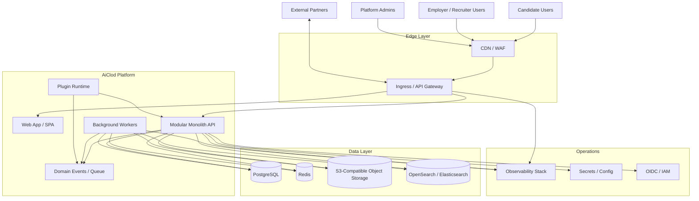
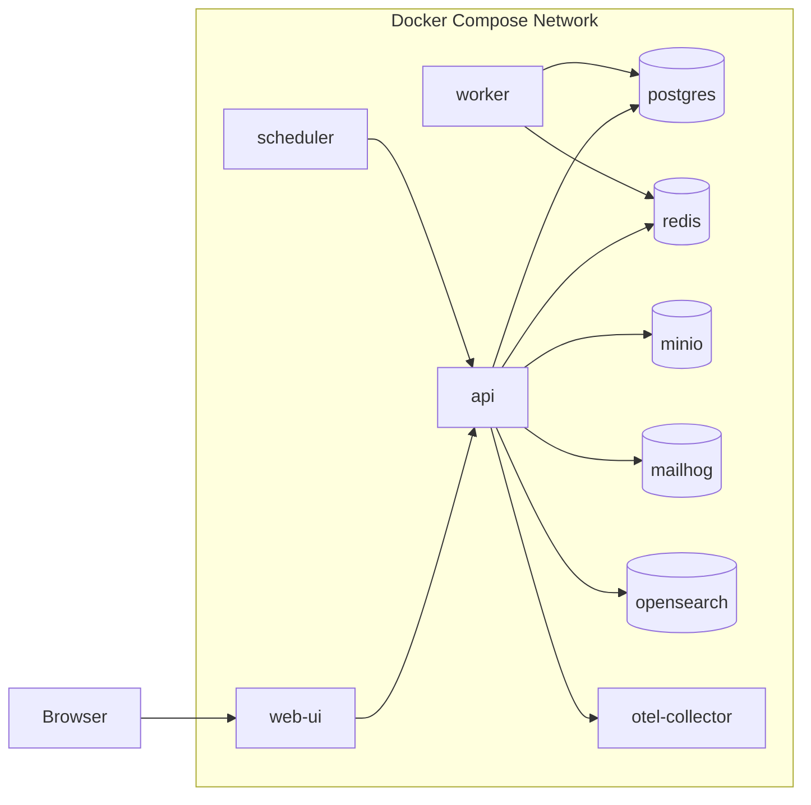
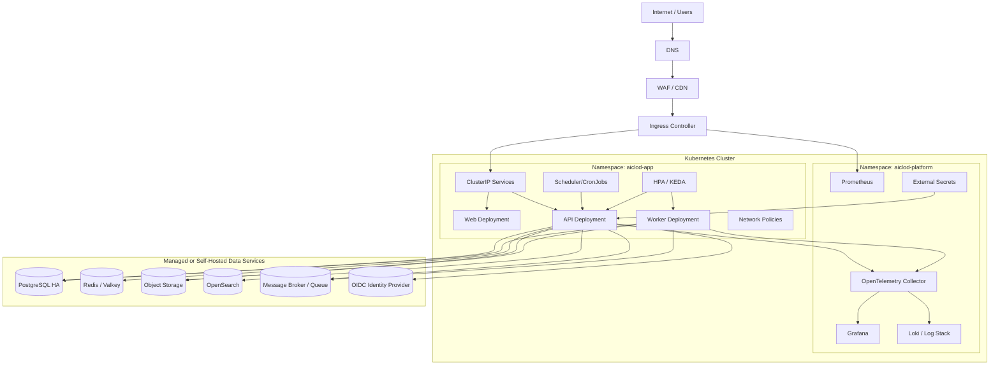
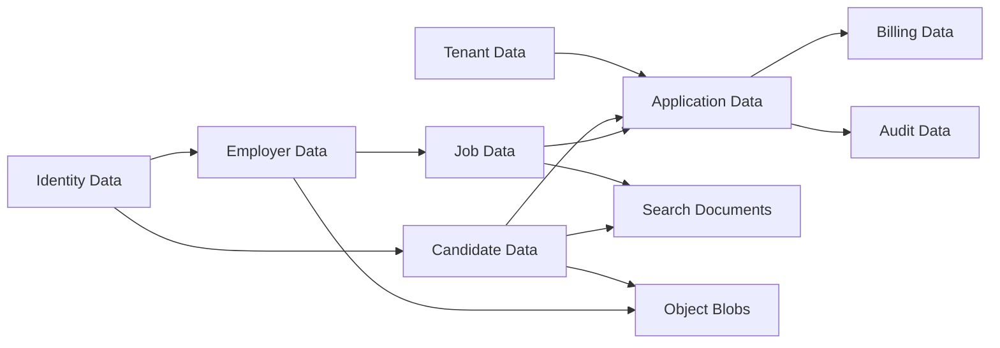
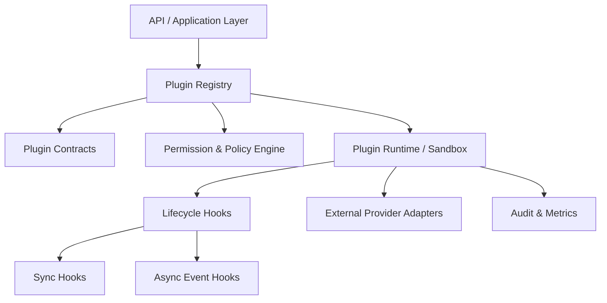
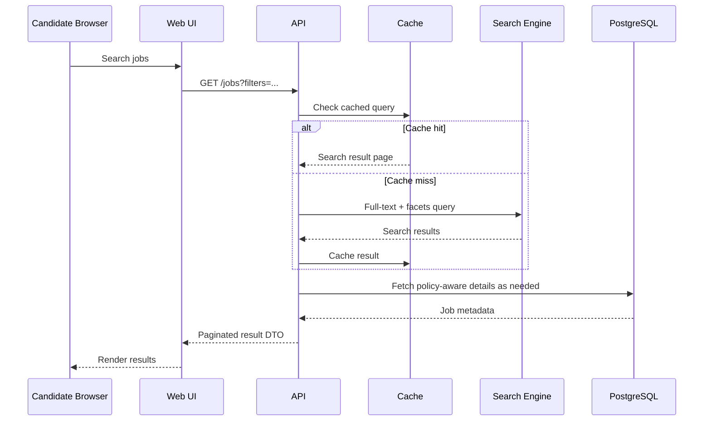
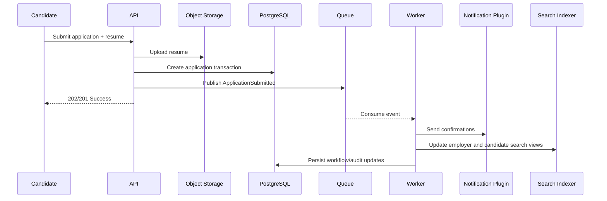

# AiClod System Architecture

## 1. Goals

AiClod is a production-ready, cloud-agnostic SaaS job portal for employers, recruiters, candidates, and platform administrators. The architecture is optimized for:

- **Fast local onboarding** with `docker-compose`.
- **Cloud deployment** on any CNCF-aligned Kubernetes platform.
- **Modular monolith delivery** today, with clear seams for **future microservice extraction**.
- **Clean Architecture** boundaries to keep domain logic independent of frameworks.
- **Plugin-based extensibility** for job ingestion, resume parsing, assessments, notifications, billing, and partner integrations.
- **Operational readiness** with autoscaling, observability, security, tenancy, and disaster recovery.

---

## 2. Architecture Principles

### 2.1 Design Principles

1. **Modular Monolith First**
   - One deployable application for velocity, consistency, and operational simplicity.
   - Internal modules communicate through explicit application services, domain events, and module APIs.
   - No cross-module database table ownership.

2. **Cloud-Agnostic by Default**
   - Kubernetes-native deployment primitives.
   - Open standards: PostgreSQL, Redis, S3-compatible object storage, OpenTelemetry, Prometheus, Grafana, Loki/ELK, Keycloak/Auth0/OIDC.
   - Works on AWS, Azure, GCP, DigitalOcean, OpenShift, Rancher, or self-managed Kubernetes.

3. **Clean Architecture**
   - Domain and use cases remain independent from delivery and infrastructure.
   - Frameworks, database engines, queues, and external APIs are adapters.

4. **Plugin Extensibility**
   - Extension points for internal and third-party capabilities.
   - Plugins are isolated behind contracts and policies.

5. **Operationally Safe**
   - Horizontal scaling for stateless workloads.
   - Queue-based async processing.
   - Defense-in-depth security.
   - Blue/green or rolling upgrades.

---

## 3. Context Diagram



---

## 4. Deployment Topology

### 4.1 Localhost Topology (`docker-compose`)

Local development uses containers that mirror production dependencies while remaining simple enough for contributor machines.



**Local objectives:**
- Single-command startup.
- Seed data for employers, jobs, applicants, and workflows.
- Mail capture with MailHog.
- S3-compatible local file storage with MinIO.
- Optional OpenSearch for full-text job search.
- OpenTelemetry collector for tracing and log forwarding.

### 4.2 Cloud Topology (Kubernetes)



**Cloud objectives:**
- Stateless app pods.
- Separate operational namespace.
- Managed data services when available, self-hosted alternatives when required.
- Autoscaling via CPU, memory, and queue depth.
- Environment-specific configuration through ConfigMaps, Secrets, and External Secrets.

---

## 5. Application Structure: Modular Monolith with Clean Architecture

### 5.1 Layered Structure

```text
interfaces/
  web/
  api/
  admin/
application/
  commands/
  queries/
  workflows/
  policies/
domain/
  candidate/
  employer/
  job/
  application/
  billing/
  notification/
  plugin/
  shared/
infrastructure/
  persistence/
  messaging/
  cache/
  search/
  storage/
  auth/
  observability/
plugins/
  builtin/
  external/
```

### 5.2 Clean Architecture Rules

- **Domain layer** contains entities, value objects, domain services, invariants, and domain events.
- **Application layer** orchestrates use cases, transactions, authorization checks, and DTO mapping.
- **Interface layer** exposes HTTP/GraphQL/WebSocket/admin endpoints.
- **Infrastructure layer** implements repositories, queues, search adapters, file storage, identity providers, and plugin loading.

### 5.3 Internal Business Modules

| Module | Responsibilities | Data Ownership |
|---|---|---|
| Identity & Access | users, organizations, roles, RBAC/ABAC, SSO mapping | user, role, membership tables |
| Tenant Management | tenant config, branding, quotas, plan limits | tenant and subscription metadata |
| Employer Management | companies, recruiters, hiring teams | employer/company data |
| Candidate Management | candidate profiles, resumes, preferences, portfolios | candidate profile data |
| Job Catalog | job requisitions, job posts, approval workflows, publishing | jobs, job metadata |
| Search & Discovery | indexing, filters, recommendations, saved searches | search documents and query analytics |
| Application Tracking | applications, statuses, notes, scoring, pipeline stages | application lifecycle data |
| Communication Hub | email, SMS, in-app notifications, templates | notification logs and templates |
| Billing & Subscription | plans, usage, invoices, payment provider abstraction | billing metadata |
| Analytics & Reporting | funnel analytics, employer KPIs, admin metrics | read models / aggregates |
| Plugin Platform | plugin registry, contracts, lifecycle, sandboxing | plugin metadata |
| Audit & Compliance | audit events, retention, legal requests | immutable audit trail |

### 5.4 Module Interaction Rules

- Modules call each other through **application service interfaces**, never direct table reads.
- Shared concepts live in a **shared kernel** only when stable and ubiquitous.
- Long-running actions publish **domain/integration events**.
- Search, email, indexing, resume parsing, and recommendation jobs are **asynchronous**.

---

## 6. Service Inventory

Although AiClod ships initially as a modular monolith, operational capabilities are separated into deployable runtime roles.

| Runtime | Primary Responsibility | Stateless | Scale Pattern |
|---|---|---|---|
| Web UI | Candidate, employer, and admin frontends | Yes | Scale on CPU/RPS |
| API | Main modular monolith serving REST/GraphQL and internal orchestration | Yes | Scale on CPU, memory, latency |
| Worker | Async jobs: notifications, indexing, resume parsing, exports, webhooks | Yes | Scale on queue depth |
| Scheduler | Cron-driven workflows, cleanup, sync jobs | Yes | 1 active / leader elected |
| Plugin Runtime | Controlled execution for plugin hooks and outbound integrations | Prefer yes | Scale with plugin demand |
| Search Engine | Full-text search and faceted filtering | Usually external | Scale by shard/replica |
| PostgreSQL | Source-of-truth relational database | No | Vertical + read replicas |
| Redis | cache, rate limiting, session state, queues/streams | No | HA or managed |
| Object Storage | resumes, logos, exports, generated reports | N/A | External service |
| Message Broker | event distribution and job buffering | No | Clustered / managed |

---

## 7. Data Architecture

### 7.1 Primary Storage Choices

- **PostgreSQL** for transactional consistency, relational data, JSONB flexibility, and partitioning support.
- **Redis/Valkey** for caching, distributed locks, session/token adjuncts, rate limiting, and short-lived workflow state.
- **S3-compatible Object Storage** for resumes, company branding assets, generated exports, and audit archives.
- **OpenSearch/Elasticsearch** for low-latency job search and candidate discovery.
- **Message Broker / Queue** for async work and integration events. Options include RabbitMQ, NATS JetStream, Kafka, Redis Streams, or cloud-managed equivalents.

### 7.2 Logical Data Domains



### 7.3 Tenancy Model

Recommended default: **shared database, shared schema, tenant discriminator** with strong row-level isolation at the application and optionally database policy layer.

Upgrade path:
1. Shared schema for SMB and mid-market tenants.
2. Dedicated schema for regulated or high-scale tenants.
3. Dedicated database/cluster for strategic enterprise customers.

All tenancy modes should preserve the same repository contracts to avoid application rewrites.

---

## 8. Plugin-Based Extensibility

### 8.1 Plugin Goals

Plugins let AiClod extend core capabilities without polluting the domain model or tightly coupling to vendor APIs.

### 8.2 Supported Plugin Categories

- Job board syndication plugins.
- Resume parsing providers.
- Candidate assessment providers.
- CRM/ATS bridge connectors.
- Notification channels.
- Payment gateways.
- HRIS integrations.
- Background verification and compliance checks.
- AI enrichment and ranking adapters.

### 8.3 Plugin Architecture



### 8.4 Plugin Model

- **Manifest-driven registration**: name, version, capabilities, required scopes, config schema, health endpoints.
- **Contract-first APIs**: each plugin type implements a narrow interface.
- **Feature flags**: plugins can be enabled by environment, tenant, plan, or user role.
- **Sandboxing options**:
  - In-process trusted plugins for first-party extensions.
  - Out-of-process sidecar/service plugins for third-party or high-risk logic.
- **Resilience**:
  - Timeout budgets.
  - Circuit breakers.
  - Retries with dead-letter queues.
  - Per-plugin rate limiting and quotas.

### 8.5 Future-Proofing

The plugin boundary doubles as the **microservice extraction seam**. A heavily used plugin runtime can later become an independent service without changing calling code materially.

---

## 9. Request and Event Flows

### 9.1 Candidate Job Search Flow



### 9.2 Job Application Submission Flow



### 9.3 Employer Job Posting Flow

1. Recruiter creates or edits a draft job.
2. Domain policies validate plan limits, permissions, and required fields.
3. Approval workflow executes if the tenant requires review.
4. On publish, the job is committed to PostgreSQL.
5. `JobPublished` event is emitted.
6. Workers update search indexes, syndicate to external job boards, and notify followers/subscribers.

### 9.4 Analytics Flow

- Product and business events are emitted from the application layer.
- Events are routed to an analytics pipeline and/or warehouse.
- Operational dashboards use Prometheus + Grafana.
- Business intelligence can read from denormalized read models or a warehouse sink.

---

## 10. Scaling Strategy

### 10.1 Stateless Scale Units

**Horizontally scalable components:**
- Web UI
- API pods
- Worker pods
- Plugin runtime pods

These components must avoid local disk dependence except ephemeral cache or temp files.

### 10.2 Kubernetes Autoscaling

Recommended autoscaling layers:

1. **Horizontal Pod Autoscaler (HPA)**
   - API based on CPU, memory, and custom latency/RPS metrics.
   - Web based on CPU and request concurrency.

2. **KEDA or queue-driven autoscaling**
   - Worker pods scale from queue depth, lag, or stream backlog.
   - Plugin runtime scales by plugin-specific queues.

3. **Cluster Autoscaler / Node Autoscaler**
   - Adds nodes when pod scheduling pressure increases.

4. **Vertical Pod Autoscaler (selective)**
   - Recommended for rightsizing non-bursty control-plane workloads, not as the primary scaling method for API pods.

### 10.3 Database Scaling

- Start with one primary PostgreSQL instance and automated backups.
- Add **read replicas** for reporting and read-heavy endpoints.
- Use **connection pooling** via PgBouncer.
- Partition large tables such as audit logs, applications, and activity streams.
- Archive historical data into object storage or cold analytics systems.

### 10.4 Search Scaling

- Use separate ingest and query node roles when search traffic becomes significant.
- Increase shard count conservatively; prefer larger shards over too many tiny shards.
- Reindex asynchronously via background workers.

### 10.5 Cache Scaling

- Cache hot reference data, public job searches, auth/session adjuncts, and rate-limit counters.
- Use tenant-aware cache keys.
- Apply explicit TTLs and stampede protection.

### 10.6 Traffic Management

- Rolling updates with readiness probes.
- Canary or blue/green deployments for risky releases.
- Sticky sessions should be avoided; use token-based auth.
- Global CDN for static assets and media delivery.

### 10.7 Multi-Region Strategy

Phase-based evolution:
- **Phase 1**: single region, multi-AZ.
- **Phase 2**: active/passive disaster recovery with database replication and object storage replication.
- **Phase 3**: active/active read-local patterns for search and content, with carefully scoped write ownership.

---

## 11. Security Architecture

### 11.1 Identity and Access

- OIDC/SAML-compatible identity provider.
- Support local auth, social login, and enterprise SSO.
- RBAC for platform roles and tenant roles.
- Optional ABAC for premium workflows.
- SCIM for enterprise provisioning.

### 11.2 Data Security

- TLS everywhere in transit.
- AES-256 or cloud-native encryption at rest.
- Secrets in Vault, External Secrets, or cloud secret managers.
- PII minimization and field-level access control.
- Resume/document scanning before persistence.

### 11.3 Platform Security

- Kubernetes NetworkPolicies.
- Pod security standards.
- Non-root containers.
- Signed images and SBOM generation.
- WAF + rate limiting at ingress.
- Audit trail for admin and high-risk actions.

### 11.4 Compliance Readiness

Design for:
- GDPR and CCPA deletion/export workflows.
- SOC 2 evidence capture.
- Tenant-specific retention policies.
- Immutable audit logs.

---

## 12. Reliability and Disaster Recovery

### 12.1 Reliability Targets

- API availability target: **99.9%+** for standard plans.
- RPO target: **< 15 minutes** for transactional data.
- RTO target: **< 1 hour** for primary-region recovery in the baseline design.

### 12.2 Resilience Patterns

- Idempotent async jobs.
- Retries with exponential backoff.
- Dead-letter queues.
- Circuit breakers for plugins and third-party providers.
- Health checks: liveness, readiness, startup probes.
- Graceful shutdown and in-flight job draining.

### 12.3 Backup Strategy

- PostgreSQL PITR backups.
- Redis persistence if used beyond ephemeral caching.
- Object storage versioning.
- Search index rebuild scripts from source-of-truth data.

---

## 13. Observability

### 13.1 Telemetry Standards

- **Metrics**: Prometheus/OpenMetrics.
- **Tracing**: OpenTelemetry.
- **Logs**: structured JSON logs aggregated in Loki/ELK.

### 13.2 Golden Signals

- Request rate, error rate, duration.
- Queue depth and job latency.
- DB query latency and saturation.
- Cache hit ratio.
- Search latency and indexing lag.
- Plugin success/failure rate.

### 13.3 Business KPIs

- Job posting conversion.
- Candidate application completion rate.
- Employer time-to-fill.
- Search-to-apply funnel.
- Notification delivery rate.

---

## 14. CI/CD and Environment Promotion

### 14.1 Environments

- Local
- Development
- Staging
- Production

### 14.2 Delivery Pipeline

1. Run linting, unit tests, contract tests, and security scanning.
2. Build immutable container images.
3. Generate SBOM and sign images.
4. Push Helm chart/Kustomize manifests.
5. Deploy automatically to development.
6. Promote to staging after smoke tests.
7. Use manual or policy-gated promotion to production.

### 14.3 IaC Approach

- Terraform/OpenTofu for cloud resources.
- Helm or Kustomize for Kubernetes manifests.
- Compose file for local parity.

---

## 15. Local-to-Cloud Parity Strategy

### 15.1 Docker Compose Services

Recommended local stack:
- `web`
- `api`
- `worker`
- `scheduler`
- `postgres`
- `redis`
- `minio`
- `mailhog`
- `opensearch` (optional profile)
- `otel-collector`

### 15.2 Kubernetes Workloads

Recommended production workloads:
- `Deployment/web`
- `Deployment/api`
- `Deployment/worker`
- `Deployment/plugin-runtime`
- `CronJob/scheduler-jobs`
- `Ingress/aiclod`
- `HPA/api`
- `ScaledObject/worker` (if using KEDA)
- `NetworkPolicy/*`
- `ExternalSecret/*`

### 15.3 Configuration Strategy

- Twelve-factor configuration.
- Environment variables for endpoints, credentials references, feature flags, tenant defaults.
- Avoid environment-specific code branches.

---

## 16. Evolution Path to Microservices

The modular monolith is intentionally organized so high-change or high-scale modules can be extracted later.

### 16.1 Likely First Extractions

1. Search & Discovery service.
2. Communication/Notification service.
3. Analytics/Reporting pipeline.
4. Plugin Runtime / Integration Hub.
5. Billing service.

### 16.2 Extraction Criteria

Extract only when one or more of the following occur:
- Independent scaling needs.
- Distinct team ownership.
- Security or compliance isolation requirements.
- Release cadence conflicts.
- Technology specialization needs.

### 16.3 Extraction Method

- Keep current module interfaces stable.
- Replace in-process calls with async messages or service APIs.
- Move module-owned tables into service-owned storage.
- Preserve domain events and contracts.

---

## 17. Recommended Technology Baseline

This architecture is cloud-agnostic, so the technology list is intentionally interchangeable.

| Concern | Preferred Baseline | Acceptable Alternatives |
|---|---|---|
| Frontend | React/Next.js | Vue/Nuxt, Angular |
| Backend | Node.js (NestJS) or Java/Kotlin (Spring Boot) or .NET | Go, Python/FastAPI |
| Database | PostgreSQL | MySQL-compatible if required |
| Cache | Redis / Valkey | KeyDB |
| Search | OpenSearch | Elasticsearch, Meilisearch (smaller scale) |
| Queue | RabbitMQ / NATS / Redis Streams / Kafka | Cloud-native queues |
| Object Storage | S3-compatible | Azure Blob, GCS, MinIO |
| Auth | Keycloak / Auth0 / Ory / cloud OIDC | Custom auth only if unavoidable |
| Deployment | Kubernetes + Helm/Kustomize | OpenShift, Rancher, managed K8s |
| Telemetry | OpenTelemetry + Prometheus + Grafana | Vendor APM with OTel support |

---

## 18. Executive Summary

AiClod should launch as a **modular monolith** with four primary runtime roles: **web**, **API**, **worker**, and **scheduler**, backed by **PostgreSQL**, **Redis**, **object storage**, **search**, and a **queue/event layer**. This provides:

- Simple developer onboarding through Docker Compose.
- Production-grade Kubernetes deployment with autoscaling.
- Clean Architecture boundaries to protect core domain logic.
- Plugin-driven extensibility for partner and AI integrations.
- A deliberate migration path toward microservices only when justified by scale, team topology, or compliance needs.

This design minimizes premature operational complexity while preserving clear extraction seams for future growth.
