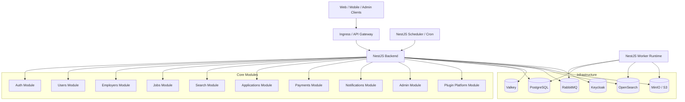
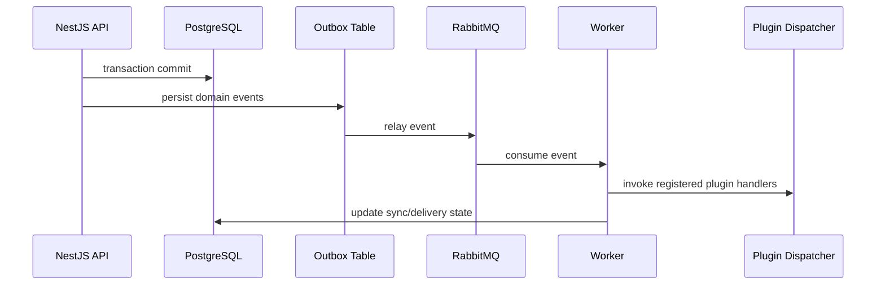

# AiClod NestJS Backend Architecture

## 1. Purpose

This document defines the **backend application architecture** for AiClod using **NestJS** as the runtime framework for the modular monolith.

It covers:

- backend module boundaries,
- Clean Architecture layering in NestJS,
- API route layout,
- service and provider structure,
- async jobs and event flow,
- plugin-based extensibility that does **not require modifying core code**.

The target is a production-ready backend that can:

- run locally with Docker Compose,
- scale horizontally on Kubernetes,
- preserve tenant isolation,
- support future microservice extraction, and
- allow third-party or tenant-specific integrations through plugins.

---

## 2. Architectural Principles

### 2.1 Modular Monolith First

AiClod should ship as a **single NestJS application** composed of explicit domain modules.

Each module:
- owns its business logic,
- exposes stable application services,
- publishes domain events,
- depends on contracts rather than implementation details of other modules.

### 2.2 Clean Architecture in NestJS

NestJS provides the delivery framework, but core rules remain:

- **Controllers** handle transport concerns only.
- **Application services/use cases** orchestrate workflows.
- **Domain entities/value objects/policies** enforce business rules.
- **Infrastructure adapters** implement persistence, queues, search, storage, and third-party integrations.

### 2.3 Plugin-Friendly by Default

The core backend must define extension points so new capabilities can be added by registering plugins rather than editing core modules.

Examples:
- payment gateway plugin,
- job board syndication plugin,
- notification channel plugin,
- resume parser plugin,
- AI scoring plugin,
- webhook consumer plugin.

---

## 2.4 Globalization and Communication Responsibilities

The backend should centralize cross-cutting global platform concerns in reusable services instead of duplicating them inside feature modules. Recommended shared services include:

- `LocaleResolver` for tenant, user, browser, and template locale fallback,
- `CurrencyFormatter` and money conversion policy services for billing and display use cases,
- `TimezoneService` for interview scheduling, reminders, and digest windows,
- `ApplicationCompliancePolicy` for region-specific application questions and consent capture, and
- `CommunicationOrchestrator` for chat, notifications, and email template rendering.

These services should be consumed by jobs, applications, payments, and notifications modules through contracts so implementations remain replaceable.

---

## 2.5 AI Service Responsibilities

The backend should expose AI features behind dedicated application services such as `RecommendationService`, `ResumeScoringService`, `SkillGapAnalysisService`, `HiringForecastService`, and `ChatbotConversationService`. These services should orchestrate prompt assembly, retrieval, provider calls, fallback rules, and persistence of explanations and audit metadata.

---

## 2.6 Admin Service Responsibilities

The backend should expose dedicated admin application services such as `AdminUserManagementService`, `EmployerReviewService`, `JobModerationService`, `FraudReviewService`, `AdminAnalyticsService`, `RevenueReportingService`, and `FeatureFlagAdministrationService`. These services should enforce role checks, emit audit events, and isolate privileged workflows from tenant-facing APIs.

---

## 3. High-Level Backend Topology



---

## 4. NestJS Application Layout

Recommended repository layout:

```text
src/
  main.ts
  app.module.ts
  bootstrap/
    config/
    logging/
    validation/
    swagger/
    security/
  shared/
    kernel/
    contracts/
    cqrs/
    events/
    exceptions/
    guards/
    interceptors/
    decorators/
    utils/
  modules/
    auth/
    users/
    employers/
    jobs/
    applications/
    search/
    payments/
    notifications/
    admin/
    plugins/
  infrastructure/
    persistence/
    messaging/
    search/
    storage/
    auth/
    cache/
    observability/
  worker/
    worker.module.ts
    consumers/
  scheduler/
    scheduler.module.ts
    jobs/
  plugins/
    builtin/
    external/
```

### 4.1 Module Internal Layout

Each domain module should follow a consistent internal structure:

```text
modules/jobs/
  jobs.module.ts
  api/
    jobs.controller.ts
    employer-jobs.controller.ts
    admin-jobs.controller.ts
    dto/
  application/
    commands/
    queries/
    services/
    handlers/
    mappers/
  domain/
    entities/
    value-objects/
    events/
    policies/
    repositories/
  infrastructure/
    persistence/
    search/
    messaging/
  contracts/
    jobs.contract.ts
```

This makes it possible to later extract a module into a microservice with minimal refactoring.

---

## 5. Root Module Composition

### 5.1 `AppModule`

The root `AppModule` composes shared platform concerns and feature modules.

```ts
@Module({
  imports: [
    ConfigModule.forRoot({ isGlobal: true }),
    LoggerModule,
    DatabaseModule,
    CacheModule,
    MessagingModule,
    StorageModule,
    SearchInfrastructureModule,
    AuthInfrastructureModule,
    ObservabilityModule,
    AuthModule,
    UsersModule,
    EmployersModule,
    JobsModule,
    ApplicationsModule,
    SearchModule,
    PaymentsModule,
    NotificationsModule,
    AdminModule,
    PluginsModule,
  ],
})
export class AppModule {}
```

### 5.2 Runtime Variants

Use the same module graph with different bootstraps:

- **API runtime**: `AppModule`
- **Worker runtime**: `WorkerModule`
- **Scheduler runtime**: `SchedulerModule`

This keeps deployment roles separate while reusing the same business logic.

---

## 6. Core Backend Modules

### 6.1 Auth Module

**Responsibilities**
- OIDC/Keycloak login integration.
- JWT validation and session/token handling.
- RBAC / policy evaluation.
- Tenant context resolution.
- SSO and identity mapping.

**Key providers**
- `AuthService`
- `TokenIntrospectionService`
- `TenantContextService`
- `PermissionService`
- `AuthPolicyService`

**Exports**
- guards,
- decorators,
- authenticated principal abstraction,
- tenant context provider.

### 6.2 Users Module

**Responsibilities**
- user profile read/update,
- user preferences,
- tenant membership lookup,
- recruiter/candidate identity data,
- account state management.

**Key providers**
- `UsersService`
- `UserProfileService`
- `MembershipService`
- `UserIdentityService`

### 6.3 Employers Module

**Responsibilities**
- organizations,
- recruiter memberships,
- employer settings,
- branding,
- hiring teams.

**Key providers**
- `EmployersService`
- `OrganizationsService`
- `EmployerMembershipService`
- `EmployerBrandingService`

### 6.4 Jobs Module

**Responsibilities**
- job creation and updates,
- approval and publishing workflows,
- job skills and locations,
- publication channel orchestration,
- lifecycle changes.

**Key providers**
- `JobsService`
- `JobPublishingService`
- `JobWorkflowService`
- `JobSkillsService`
- `JobChannelService`

### 6.5 Applications Module

**Responsibilities**
- candidate applications,
- stage transitions,
- timeline events,
- attachments,
- employer-side review workflow.

**Key providers**
- `ApplicationsService`
- `ApplicationWorkflowService`
- `ApplicationTimelineService`
- `ResumeSubmissionService`

### 6.6 Search Module

**Responsibilities**
- public job search APIs,
- candidate search for employers,
- query filters/facets,
- search indexing orchestration,
- fallback PostgreSQL search support.

**Key providers**
- `SearchService`
- `JobSearchService`
- `CandidateSearchService`
- `SearchIndexSyncService`

### 6.7 Payments Module

**Responsibilities**
- subscriptions,
- invoice reads,
- payment processing through plugins,
- billing events,
- quota enforcement integration.

**Key providers**
- `PaymentsService`
- `SubscriptionService`
- `InvoiceService`
- `PaymentMethodService`
- `BillingWebhookService`

### 6.8 Notifications Module

**Responsibilities**
- email, SMS, webhook, and in-app notifications,
- template rendering,
- notification preferences,
- asynchronous dispatch,
- delivery logging.

**Key providers**
- `NotificationsService`
- `TemplateRendererService`
- `DeliveryOrchestratorService`
- `NotificationPreferenceService`

### 6.9 Admin Module

**Responsibilities**
- tenant administration,
- support tooling,
- audit review,
- feature flags,
- plugin management views,
- platform metrics endpoints.

**Key providers**
- `AdminService`
- `TenantAdminService`
- `AuditAdminService`
- `FeatureFlagAdminService`
- `PluginAdminService`

### 6.10 Plugins Module

**Responsibilities**
- plugin registration,
- manifest loading,
- plugin configuration,
- capability lookup,
- plugin execution policies,
- plugin lifecycle hooks.

**Key providers**
- `PluginRegistryService`
- `PluginLoaderService`
- `PluginExecutionService`
- `PluginConfigService`
- `PluginHealthService`

---

## 7. Shared Cross-Cutting Components

### 7.1 Shared Services

These should live in `shared/` or infrastructure modules and be reused across feature modules:

- `RequestContextService`
- `TenantContextService`
- `CurrentUserService`
- `IdGeneratorService`
- `ClockService`
- `EventBus`
- `UnitOfWork`
- `OutboxPublisherService`
- `FeatureFlagService`
- `FileUploadPolicyService`

### 7.2 Guards and Interceptors

Recommended guards:
- `JwtAuthGuard`
- `TenantGuard`
- `RolesGuard`
- `PolicyGuard`
- `ApiKeyGuard` for plugin or webhook endpoints

Recommended interceptors:
- `RequestLoggingInterceptor`
- `TracingInterceptor`
- `TenantResponseInterceptor`
- `TimeoutInterceptor`
- `IdempotencyInterceptor` for payment/webhook-sensitive endpoints

### 7.3 Shared Contracts

Shared contracts should be explicit interfaces, not implicit imports between modules.

Examples:
- `IUserRepository`
- `IJobRepository`
- `INotificationChannel`
- `IPaymentGatewayPlugin`
- `ISearchIndexer`
- `IResumeParserPlugin`

---

## 8. API Design and Route Structure

Base versioning convention:

- `/api/v1/...` for public/backend APIs
- `/internal/v1/...` for trusted platform-to-platform calls
- `/admin/v1/...` for platform administration
- `/webhooks/v1/...` for inbound third-party callbacks

### 8.1 Auth Routes

| Method | Route | Purpose |
|---|---|---|
| GET | `/api/v1/auth/me` | current principal and tenant context |
| POST | `/api/v1/auth/token/refresh` | refresh session/token |
| POST | `/api/v1/auth/logout` | logout current session |
| GET | `/api/v1/auth/providers` | enabled auth providers |
| POST | `/webhooks/v1/auth/scim/users` | SCIM user provisioning |
| POST | `/webhooks/v1/auth/scim/groups` | SCIM group provisioning |

### 8.2 Users Routes

| Method | Route | Purpose |
|---|---|---|
| GET | `/api/v1/users/me` | current user profile |
| PATCH | `/api/v1/users/me` | update user profile |
| GET | `/api/v1/users/me/memberships` | tenant memberships |
| GET | `/api/v1/users/:userId` | admin/recruiter lookup |
| PATCH | `/admin/v1/users/:userId/status` | suspend/restore user |

### 8.3 Employers Routes

| Method | Route | Purpose |
|---|---|---|
| GET | `/api/v1/employers/organizations` | list organizations for current tenant |
| POST | `/api/v1/employers/organizations` | create organization |
| GET | `/api/v1/employers/organizations/:orgId` | organization detail |
| PATCH | `/api/v1/employers/organizations/:orgId` | update organization |
| GET | `/api/v1/employers/organizations/:orgId/members` | recruiter team |
| POST | `/api/v1/employers/organizations/:orgId/members` | add recruiter/hiring manager |
| DELETE | `/api/v1/employers/organizations/:orgId/members/:memberId` | remove membership |

### 8.4 Jobs Routes

| Method | Route | Purpose |
|---|---|---|
| GET | `/api/v1/jobs` | public or tenant-filtered job search |
| POST | `/api/v1/jobs` | create job draft |
| GET | `/api/v1/jobs/:jobId` | job detail |
| PATCH | `/api/v1/jobs/:jobId` | update job |
| POST | `/api/v1/jobs/:jobId/publish` | publish job |
| POST | `/api/v1/jobs/:jobId/pause` | pause job |
| POST | `/api/v1/jobs/:jobId/close` | close job |
| GET | `/api/v1/jobs/:jobId/channels` | publication channel statuses |
| POST | `/api/v1/jobs/:jobId/channels/:channelCode/sync` | force channel sync |

### 8.5 Applications Routes

| Method | Route | Purpose |
|---|---|---|
| POST | `/api/v1/jobs/:jobId/applications` | candidate applies to a job |
| GET | `/api/v1/applications/:applicationId` | application detail |
| GET | `/api/v1/jobs/:jobId/applications` | employer pipeline view |
| POST | `/api/v1/applications/:applicationId/stage` | move stage |
| POST | `/api/v1/applications/:applicationId/withdraw` | candidate withdraws |
| POST | `/api/v1/applications/:applicationId/notes` | recruiter note |
| GET | `/api/v1/applications/:applicationId/timeline` | event timeline |

### 8.6 Search Routes

| Method | Route | Purpose |
|---|---|---|
| GET | `/api/v1/search/jobs` | advanced job search |
| GET | `/api/v1/search/candidates` | employer-side candidate discovery |
| POST | `/internal/v1/search/reindex/jobs/:jobId` | reindex one job |
| POST | `/internal/v1/search/reindex/candidates/:candidateId` | reindex one candidate |
| POST | `/internal/v1/search/reindex/full` | full rebuild trigger |

### 8.7 Payments Routes

| Method | Route | Purpose |
|---|---|---|
| GET | `/api/v1/payments/subscription` | current subscription |
| POST | `/api/v1/payments/subscription/checkout` | begin plan checkout |
| PATCH | `/api/v1/payments/subscription` | change plan or renewal mode |
| GET | `/api/v1/payments/invoices` | invoice list |
| GET | `/api/v1/payments/invoices/:invoiceId` | invoice detail |
| GET | `/api/v1/payments/methods` | payment methods |
| POST | `/webhooks/v1/payments/:providerCode` | payment provider webhook |

### 8.8 Notifications Routes

| Method | Route | Purpose |
|---|---|---|
| GET | `/api/v1/notifications` | notification history |
| PATCH | `/api/v1/notifications/:notificationId/read` | mark read |
| GET | `/api/v1/notifications/preferences` | delivery preferences |
| PATCH | `/api/v1/notifications/preferences` | update preferences |
| POST | `/internal/v1/notifications/test` | test notification delivery |

### 8.9 Admin Routes

| Method | Route | Purpose |
|---|---|---|
| GET | `/admin/v1/tenants` | tenant list |
| GET | `/admin/v1/tenants/:tenantId` | tenant detail |
| PATCH | `/admin/v1/tenants/:tenantId/status` | suspend/reactivate tenant |
| GET | `/admin/v1/audit` | audit log search |
| GET | `/admin/v1/plugins` | registered plugins |
| PATCH | `/admin/v1/plugins/:pluginId` | enable/disable plugin |
| GET | `/admin/v1/health/integrations` | plugin/provider health |

---

## 9. Controller and Service Structure

### 9.1 Controller Rules

Controllers should:
- validate DTOs,
- enforce guards,
- call a single application service or command handler,
- map results to response DTOs,
- avoid business logic.

Example structure:

```ts
@Controller('api/v1/jobs')
export class JobsController {
  constructor(private readonly jobsService: JobsService) {}

  @Post()
  createJob(@Body() dto: CreateJobDto, @CurrentPrincipal() principal: Principal) {
    return this.jobsService.createDraft({ dto, principal });
  }

  @Post(':jobId/publish')
  publishJob(@Param('jobId') jobId: string, @CurrentPrincipal() principal: Principal) {
    return this.jobsService.publish({ jobId, principal });
  }
}
```

### 9.2 Application Service Rules

Application services should:
- start/participate in transactions,
- load aggregates via repositories,
- enforce module policies,
- publish domain events,
- invoke plugin hooks through contracts when necessary.

Example:

```ts
@Injectable()
export class JobPublishingService {
  constructor(
    private readonly jobsRepo: JobRepository,
    private readonly eventBus: DomainEventBus,
    private readonly pluginDispatcher: PluginDispatcher,
  ) {}

  async publish(command: PublishJobCommand): Promise<void> {
    const job = await this.jobsRepo.getById(command.jobId, command.tenantId);
    job.publish(command.actorId);
    await this.jobsRepo.save(job);
    await this.eventBus.publish(job.pullDomainEvents());
    await this.pluginDispatcher.dispatch('job.published', {
      tenantId: command.tenantId,
      jobId: job.id,
    });
  }
}
```

### 9.3 Repository Rules

Repositories should be module-owned and hidden behind interfaces.

Example contracts:
- `JobsRepository`
- `ApplicationsRepository`
- `OrganizationsRepository`
- `SubscriptionsRepository`

Implementation classes live in each module’s infrastructure layer or in shared persistence adapters.

---

## 10. Async Processing Model

### 10.1 Why Async

The backend should keep request paths fast by offloading heavy or external work such as:

- notification delivery,
- job board syndication,
- OpenSearch indexing,
- resume parsing,
- payment reconciliation,
- analytics event processing,
- webhook retries.

### 10.2 Worker Structure

```text
worker/
  worker.module.ts
  consumers/
    job-published.consumer.ts
    application-submitted.consumer.ts
    payment-webhook.consumer.ts
    notification-dispatch.consumer.ts
    search-reindex.consumer.ts
```

### 10.3 Event Flow



### 10.4 Recommended Queues

- `jobs.publish`
- `jobs.reindex`
- `applications.submitted`
- `applications.stage-changed`
- `payments.webhooks`
- `notifications.dispatch`
- `plugins.dispatch`
- `analytics.ingest`

---

## 11. Plugin-Based Extensibility Without Core Code Changes

### 11.1 Design Goal

New integrations must be addable by:
- registering a plugin manifest,
- providing plugin configuration,
- implementing one or more declared contracts,
- enabling the plugin for a tenant or environment.

The core modules should **not** require code edits when adding a new provider in an already-supported capability category.

### 11.2 Plugin Capability Types

Recommended first-class plugin capability types:

- `payment-gateway`
- `notification-channel`
- `resume-parser`
- `job-board-publisher`
- `search-enricher`
- `assessment-provider`
- `webhook-sink`
- `ai-ranking-provider`

### 11.3 Plugin Manifest

Example plugin manifest:

```json
{
  "id": "payments.stripe",
  "version": "1.0.0",
  "kind": "payment-gateway",
  "entrypoint": "./dist/plugin.js",
  "capabilities": ["checkout", "webhook", "refund"],
  "configSchema": {
    "type": "object",
    "required": ["apiKey", "webhookSecret"]
  },
  "healthcheck": {
    "type": "http",
    "path": "/health"
  }
}
```

### 11.4 Plugin Contract Interfaces

```ts
export interface PaymentGatewayPlugin {
  kind: 'payment-gateway';
  createCheckoutSession(input: CreateCheckoutSessionInput): Promise<CheckoutSession>;
  handleWebhook(input: PaymentWebhookInput): Promise<PaymentWebhookResult>;
  refundPayment(input: RefundPaymentInput): Promise<RefundResult>;
}

export interface NotificationChannelPlugin {
  kind: 'notification-channel';
  send(input: NotificationSendInput): Promise<NotificationSendResult>;
}

export interface JobBoardPublisherPlugin {
  kind: 'job-board-publisher';
  publishJob(input: PublishJobInput): Promise<PublishJobResult>;
  unpublishJob(input: UnpublishJobInput): Promise<void>;
}
```

### 11.5 Plugin Registration Flow

1. Plugin package is deployed into `plugins/external` or installed as a trusted dependency.
2. `PluginLoaderService` reads manifests at bootstrap.
3. `PluginRegistryService` validates capability compatibility.
4. `PluginConfigService` loads environment or tenant-specific config.
5. Core modules resolve providers by capability, not by vendor-specific classes.

### 11.6 Plugin Resolution Example

```ts
@Injectable()
export class PaymentsService {
  constructor(private readonly plugins: PluginRegistryService) {}

  async createCheckoutSession(command: CreateCheckoutSessionCommand) {
    const gateway = await this.plugins.resolvePaymentGateway(command.tenantId);
    return gateway.createCheckoutSession(command);
  }
}
```

### 11.7 Safety Rules

- enforce per-plugin timeouts,
- isolate third-party plugin failures from core request success where possible,
- require idempotency for payment and webhook plugins,
- log plugin input/output metadata safely,
- maintain per-plugin audit trails and metrics,
- support circuit breakers and dead-letter queues.

### 11.8 In-Process vs Out-of-Process Plugins

**In-process plugins**
- best for trusted, first-party, low-risk adapters,
- lowest latency,
- easiest to develop.

**Out-of-process plugins**
- best for untrusted or operationally heavy integrations,
- safer isolation,
- ideal for future extraction into standalone services.

The registry should support both models through the same capability contract.

---

## 12. Example NestJS Module Definitions

### 12.1 Jobs Module

```ts
@Module({
  controllers: [JobsController, EmployerJobsController, AdminJobsController],
  providers: [
    JobsService,
    JobPublishingService,
    JobWorkflowService,
    JobSkillsService,
    JobChannelService,
    JobRepository,
    JobChannelRepository,
  ],
  exports: [JobsService, JobPublishingService],
})
export class JobsModule {}
```

### 12.2 Plugins Module

```ts
@Module({
  providers: [
    PluginRegistryService,
    PluginLoaderService,
    PluginExecutionService,
    PluginConfigService,
    PluginHealthService,
  ],
  exports: [PluginRegistryService, PluginExecutionService],
})
export class PluginsModule {}
```

---

## 13. Security and Tenant Isolation in the Backend

Every request should resolve:

- authenticated principal,
- current tenant,
- current organization scope when applicable,
- permission set and feature flags.

### 13.1 Recommended Request Context

```ts
export interface RequestContext {
  requestId: string;
  tenantId: string;
  userId?: string;
  roles: string[];
  organizationIds: string[];
  featureFlags: string[];
}
```

### 13.2 Enforcement Rules

- controllers must not trust raw route parameters alone,
- services must always query repositories with `tenantId`,
- internal routes must require service authentication,
- webhook endpoints must validate signatures,
- admin routes must use stricter policies than tenant routes.

---

## 14. Future Microservice Extraction Seams

The following modules are the most likely early extraction candidates:

1. `search`
2. `notifications`
3. `payments`
4. `plugins`
5. `analytics` if introduced as a dedicated module later

Extraction is simplified because each module already has:
- clear route ownership,
- explicit service contracts,
- isolated repositories,
- event-based integration points.

---

## 15. Recommended Implementation Sequence

1. Bootstrap shared infrastructure modules.
2. Implement `auth`, `users`, and `employers`.
3. Implement `jobs` and `applications`.
4. Add `search` indexing and query flows.
5. Add `notifications` and async delivery.
6. Add `payments` through plugin contracts.
7. Add `admin` tooling.
8. Add external plugins without changing core module code.

This sequence gets the hiring workflow live first while preserving the backend architecture required for scale and extensibility.
