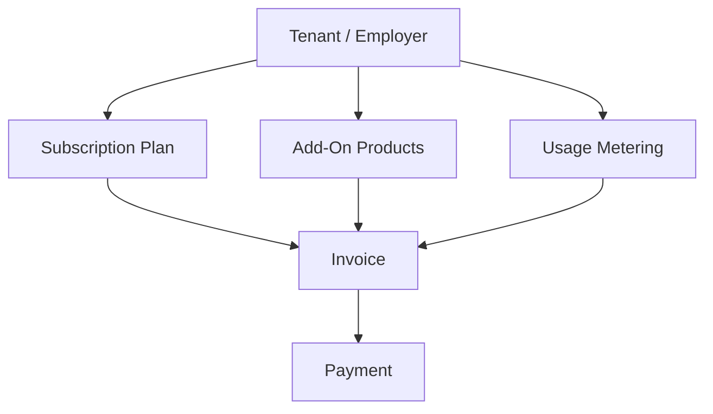
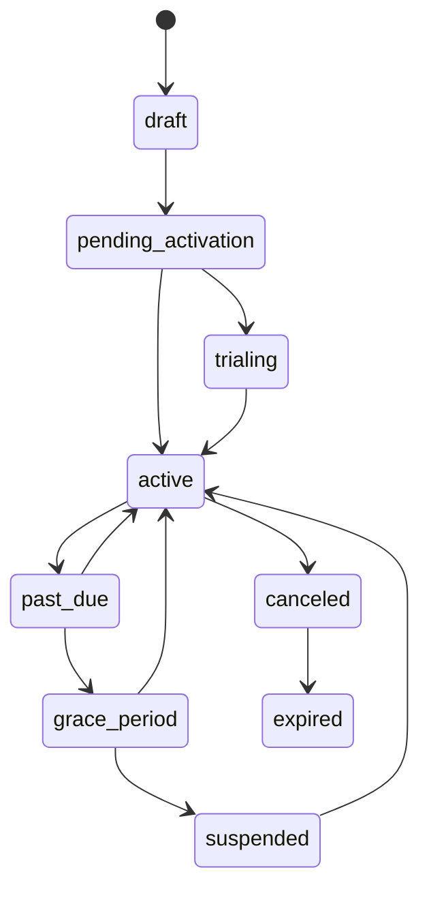

# AiClod Monetization and Billing Architecture

## 1. Purpose

This document defines the **monetization and billing architecture** for AiClod.

It covers:

- subscriptions,
- featured jobs,
- resume database access,
- premium visibility products,
- subscription lifecycle management,
- invoicing,
- payment gateway abstraction,
- usage-based pricing.

The goal is to make AiClod commercially viable as a SaaS job portal while remaining flexible enough for SMB, growth, enterprise, and marketplace-style monetization models.

---

## 2. Monetization Principles

AiClod monetization should follow these principles:

1. **Clear packaging** for employers and recruiters.
2. **Predictable recurring revenue** through subscriptions.
3. **Flexible add-ons** for promotional and premium visibility products.
4. **Usage-aware charging** for variable consumption areas.
5. **Gateway abstraction** so payments are not coupled to one vendor.
6. **Tenant-safe billing enforcement** integrated with quotas and feature flags.
7. **Auditability** for invoices, entitlement changes, and financial events.

---

## 3. Revenue Streams

AiClod should support four primary monetization streams.

### 3.1 Subscription Plans

Core recurring plans for employers/organizations.

Examples:
- Starter
- Growth
- Business
- Enterprise

These plans typically govern:
- active job slots,
- recruiter seats,
- applicant pipeline access,
- search/filter depth,
- analytics availability,
- plugin/integration access,
- customer support tier.

### 3.2 Featured Jobs

Employers can purchase promotional visibility for specific jobs.

Examples:
- homepage featured placement,
- search-result boosted placement,
- category page highlight,
- urgent hiring badge,
- newsletter inclusion.

These are best implemented as:
- one-time purchases,
- package bundles,
- or subscription add-ons with a monthly included allowance.

### 3.3 Resume Database Access

Employers can pay for candidate discovery beyond inbound applications.

Packaging options:
- limited monthly resume/profile unlocks,
- recruiter seat bundles with included search credits,
- pay-per-contact unlock,
- enterprise unlimited access with fair-use controls.

### 3.4 Premium Visibility Products

Premium visibility can apply to both jobs and candidates.

Examples:
- sponsored employer branding,
- top-of-search placement,
- premium company profile,
- premium candidate profile visibility,
- profile boost for job seekers,
- featured employer campaigns.

---

## 4. Commercial Product Model

AiClod should model monetization in three layers:

1. **Base subscription plans**
2. **Add-on products**
3. **Usage-metered products**



### 4.1 Base Plan Entitlements

Entitlements controlled by the subscription should include:

- `max_active_jobs`
- `max_recruiter_seats`
- `resume_search_enabled`
- `monthly_resume_unlocks`
- `analytics_tier`
- `api_access_enabled`
- `plugin_limit`
- `support_sla_tier`

### 4.2 Add-On Product Types

Recommended add-on product categories:

- `featured_job_credit_pack`
- `additional_job_slot_pack`
- `resume_unlock_pack`
- `premium_company_profile`
- `priority_support`
- `campaign_boost_bundle`

### 4.3 Usage-Metered Product Types

Recommended usage-metered dimensions:

- additional active jobs above plan quota,
- candidate profile unlocks,
- outbound candidate contact credits,
- SMS/notification overage,
- premium campaign impressions/clicks,
- API usage over base plan quota.

---

## 5. Pricing Model Design

### 5.1 Subscription Pricing

Support:
- monthly billing,
- annual billing,
- enterprise contract billing,
- trials,
- custom negotiated pricing.

### 5.2 Included vs Metered Entitlements

Example plan design:

| Capability | Starter | Growth | Business | Enterprise |
|---|---|---|---|---|
| Active jobs | 3 | 15 | 50 | custom |
| Recruiter seats | 1 | 5 | 20 | custom |
| Resume unlocks / month | 25 | 250 | 1000 | custom |
| Featured jobs / month | 0 | 2 | 10 | custom |
| Candidate search access | limited | standard | advanced | full |
| Analytics | basic | standard | advanced | enterprise |

### 5.3 Usage-Based Pricing Patterns

Use usage pricing where value scales directly with consumption.

Recommended examples:
- per resume unlock,
- per candidate outreach above included quota,
- per featured job boost after included credits are exhausted,
- per extra job slot above included threshold,
- per API call bucket above plan limit.

### 5.4 Packaging Recommendation

Recommended commercial model for launch:

- recurring subscription for platform access,
- included monthly credits for premium actions,
- overage pricing for additional usage,
- one-time add-on packs for flexibility,
- enterprise negotiated contract override.

This model is simple enough to launch and rich enough to scale commercially.

---

## 6. Entitlements and Quotas

### 6.1 Why Entitlements Matter

Billing must not live only in finance records; it must control runtime behavior.

The platform needs an **Entitlements Service** that evaluates whether a tenant can:
- create another active job,
- access resume database search,
- unlock a candidate profile,
- boost a job,
- access premium analytics,
- use premium integrations.

### 6.2 Runtime Entitlement Categories

Recommended categories:

- **binary flags**: enabled/disabled
- **hard quotas**: maximum allowed count
- **soft quotas**: can exceed but triggers usage billing
- **credit balances**: decrementing premium units
- **plan tier labels**: feature tier gates

### 6.3 Example Entitlement Payload

```json
{
  "tenantId": "tenant_1",
  "planCode": "growth",
  "features": {
    "resume_search_enabled": true,
    "premium_company_profile": false,
    "advanced_analytics": true
  },
  "quotas": {
    "max_active_jobs": 15,
    "max_recruiter_seats": 5,
    "monthly_resume_unlocks": 250
  },
  "credits": {
    "featured_job_credits": 2,
    "resume_unlock_credits": 34
  },
  "usage": {
    "active_jobs": 12,
    "recruiter_seats": 4,
    "resume_unlocks_this_period": 216
  }
}
```

### 6.4 Enforcement Model

Enforcement should happen in this order:

1. Validate tenant subscription state.
2. Check feature enabled/disabled status.
3. Check included quota.
4. If over quota, determine whether overage billing is allowed.
5. If not allowed, block action with upgrade/add-on CTA.
6. If allowed, meter the event for billing.

---

## 7. Product-Specific Monetization Flows

## 7.1 Subscription Flow

1. Employer selects plan.
2. Billing checkout session is created through payment gateway abstraction.
3. Subscription enters `pending_activation` or `trialing`.
4. Payment confirmation/webhook activates subscription.
5. Entitlements are provisioned for the tenant.
6. Renewals, upgrades, downgrades, and cancellations update entitlements and invoices.

## 7.2 Featured Job Flow

1. Employer publishes or edits a job.
2. Employer chooses featured placement option.
3. System checks for included featured credits.
4. If credits exist, consume credit and activate boost.
5. If not, route to add-on purchase or usage charge.
6. Search ranking/promotion flags are updated.
7. Promotion expires automatically at the configured end date.

## 7.3 Resume Database Access Flow

1. Employer accesses candidate search.
2. Search result list may show blurred or limited preview fields.
3. Employer opens/unlocks candidate profile.
4. System checks included quota or credit balance.
5. If allowed, decrement included usage or create a billable usage event.
6. Candidate profile/contact details become visible according to policy.
7. Usage is attached to the current billing period.

## 7.4 Premium Visibility Flow

Examples:
- premium employer branding package,
- promoted candidate visibility,
- sponsored search placement.

Recommended pattern:
- store premium product assignment with start/end dates,
- expose premium state to frontend and search ranking logic,
- meter exposure when pricing depends on impressions or clicks.

---

## 8. Billing Domain Services

Recommended backend services in the billing domain:

- `SubscriptionService`
- `EntitlementsService`
- `UsageMeteringService`
- `InvoiceService`
- `PricingService`
- `PaymentGatewayRouter`
- `CheckoutService`
- `CreditsService`
- `TaxService`
- `BillingWebhookService`

### 8.1 Service Responsibilities

**SubscriptionService**
- create, update, renew, cancel subscriptions
- manage upgrades/downgrades/proration policies

**EntitlementsService**
- resolve effective plan + add-ons + credits + temporary promos
- answer runtime permission/quota questions

**UsageMeteringService**
- record billable events
- aggregate usage by billing period and product code

**InvoiceService**
- generate invoices
- apply line items, taxes, discounts, credits, and adjustments

**PaymentGatewayRouter**
- resolve the configured payment gateway plugin
- shield business logic from vendor-specific APIs

**CreditsService**
- allocate, consume, expire, refund, and audit credits

---

## 9. Subscription Lifecycle

### 9.1 Recommended Subscription States

- `draft`
- `pending_activation`
- `trialing`
- `active`
- `past_due`
- `grace_period`
- `suspended`
- `canceled`
- `expired`

### 9.2 Lifecycle Transitions



### 9.3 Upgrade and Downgrade Rules

Support:
- immediate upgrade with proration,
- scheduled downgrade at period end,
- annual-to-monthly renewal changes,
- enterprise contract override,
- manual finance-assisted adjustments.

### 9.4 Grace Period Behavior

During `grace_period`:
- existing jobs may remain visible,
- creation of new billable resources may be blocked,
- recruiter/admin warning banners should appear,
- payment recovery flows should be active.

---

## 10. Usage Metering Architecture

### 10.1 Billable Event Types

Recommended billable events:

- `job_slot.activated`
- `job.featured`
- `candidate.resume_unlocked`
- `candidate.contact_revealed`
- `api.request_overage`
- `notification.sms_sent`
- `premium.visibility_impression`
- `premium.visibility_click`

### 10.2 Metering Event Shape

```json
{
  "tenantId": "tenant_1",
  "productCode": "resume_unlock",
  "eventType": "candidate.resume_unlocked",
  "resourceId": "candidate_456",
  "quantity": 1,
  "occurredAt": "2026-03-21T10:15:00Z",
  "metadata": {
    "actorUserId": "user_99",
    "jobId": "job_123"
  }
}
```

### 10.3 Metering Pipeline

1. Product action occurs in the app.
2. Billing enforcement checks entitlement.
3. Event is written to transactional store/outbox.
4. Metering worker aggregates into billing-period usage counters.
5. Usage is billed immediately or included in the next invoice, depending on product configuration.

### 10.4 Idempotency

Usage recording must be idempotent.

Examples:
- candidate unlock should not double-charge on retries,
- payment webhook replays must not duplicate invoice settlements,
- featured job activation retries should not consume multiple credits.

---

## 11. Featured Jobs and Premium Visibility Data Model

### 11.1 Featured Job Assignment

Recommended record fields:

- `job_id`
- `tenant_id`
- `promotion_type`
- `start_at`
- `end_at`
- `source_type` (`included_credit`, `add_on_purchase`, `usage_billed`)
- `invoice_line_item_id`
- `status`
- `boost_weight`

### 11.2 Candidate/Profile Premium Visibility

For premium candidate products, support:
- profile boost windows,
- premium badge flags,
- boosted search ranking multipliers,
- campaign attribution.

### 11.3 Ranking Integration

Search ranking should consume promotion metadata as business signals, but with guardrails:
- prevent low-quality spam jobs from dominating purely through payments,
- cap promotional boost,
- preserve relevance quality.

---

## 12. Resume Database Access Commercial Model

### 12.1 Access Modes

Support multiple resume database monetization modes:

- **included access** within subscription,
- **credit-based unlocks**,
- **seat-based access**,
- **enterprise unlimited fair-use model**.

### 12.2 Unlock Semantics

Define precisely what a billable unlock means.

Recommended definition:
- first reveal of protected candidate contact/profile detail by a tenant during an active billing period.

This avoids double billing for repeated views of the same candidate within the same period.

### 12.3 Fair Use and Abuse Controls

- cap suspicious burst unlock behavior,
- limit exports on lower plans,
- monitor repeated scraper-like patterns,
- require stronger permissions for bulk actions.

---

## 13. Invoice and Accounting Design

### 13.1 Invoice Components

Invoices should support:

- recurring subscription line items,
- add-on purchases,
- usage charges,
- credits and discounts,
- taxes,
- manual adjustments,
- refunds/negative adjustments where needed.

### 13.2 Invoice Line Item Categories

Recommended categories:

- `subscription_base`
- `subscription_proration`
- `featured_job_addon`
- `resume_unlock_usage`
- `job_slot_overage`
- `sms_overage`
- `manual_adjustment`
- `tax`
- `credit`

### 13.3 Invoicing Modes

Support:
- automatic recurring invoicing,
- immediate checkout invoices for one-time add-ons,
- monthly arrears invoicing for usage,
- manual enterprise invoices.

### 13.4 Invoice Generation Process

1. Resolve billing period and active subscription.
2. Gather included recurring items.
3. Aggregate metered usage.
4. Apply credits and discounts.
5. Calculate tax.
6. Finalize invoice.
7. Attempt collection or send for manual payment.
8. Record settlement state.

---

## 14. Payment Gateway Abstraction

### 14.1 Why Abstraction Matters

AiClod should not couple business billing logic directly to Stripe, Adyen, Razorpay, or any single provider.

### 14.2 Gateway Contract

Recommended capabilities:

- create checkout session
- attach/update payment method
- create or update subscription
- cancel subscription
- collect one-time payment
- issue refund
- verify webhook signature
- fetch invoice or payment status

### 14.3 Example Interface

```ts
export interface PaymentGatewayPlugin {
  createCheckoutSession(input: CheckoutSessionInput): Promise<CheckoutSessionResult>;
  createSubscription(input: CreateSubscriptionInput): Promise<CreateSubscriptionResult>;
  updateSubscription(input: UpdateSubscriptionInput): Promise<UpdateSubscriptionResult>;
  cancelSubscription(input: CancelSubscriptionInput): Promise<void>;
  chargeInvoice(input: ChargeInvoiceInput): Promise<ChargeInvoiceResult>;
  refundPayment(input: RefundPaymentInput): Promise<RefundPaymentResult>;
  verifyWebhook(input: VerifyWebhookInput): Promise<VerifiedWebhookEvent>;
}
```

### 14.4 Gateway Routing Policy

Possible routing dimensions:
- region,
- currency,
- tenant contract,
- payment method support,
- failover policy.

Example:
- US and EU self-serve tenants use primary gateway A,
- India region may use gateway B,
- enterprise manual invoicing bypasses online gateway flows.

---

## 15. Discounts, Trials, and Promotions

### 15.1 Discount Types

Support:
- coupon percentage off,
- fixed amount off,
- trial extension,
- waived setup/onboarding fee,
- promotional featured-job credits,
- custom enterprise discounting.

### 15.2 Trial Model

Recommended trial rules:
- 7-day or 14-day self-serve trial,
- plan-based trial eligibility,
- optional card-upfront or no-card trial,
- automated reminders before conversion.

### 15.3 Promotion Handling

Promotions should create explicit records with:
- promotion code,
- eligibility rules,
- start/end validity,
- affected products,
- usage limits.

---

## 16. Entitlement + Search + Product Integration

Monetization affects runtime product behavior in multiple places.

### 16.1 Search Integration

- featured jobs increase ranking/placement according to controlled boost rules,
- resume database access controls whether candidate contact details are visible,
- premium company profiles can affect branding surfaces.

### 16.2 Frontend Integration

Frontend should receive entitlement-aware payloads such as:
- remaining featured credits,
- remaining resume unlocks,
- upgrade prompts,
- blocked action reasons,
- subscription renewal state.

### 16.3 Admin Integration

Admin tools should support:
- granting credits,
- manual adjustments,
- forcing plan changes,
- comped subscriptions,
- disputed payment handling,
- audit review of billing events.

---

## 17. Operational and Compliance Considerations

### 17.1 Reliability Requirements

- idempotent payment webhook handling,
- invoice generation replay safety,
- metering replay support,
- durable audit trail,
- gateway outage fallback procedures.

### 17.2 Compliance Areas

- tax handling by region,
- invoice retention,
- refund auditability,
- GDPR/CCPA considerations for billing contacts,
- secure tokenized payment method handling via gateway providers.

### 17.3 Finance Reconciliation

Track and reconcile:
- payment attempts,
- successful settlements,
- refunds,
- invoice aging,
- gateway payout reconciliation,
- usage-to-billing variance.

---

## 18. Recommended Implementation Sequence

1. Implement subscription plans, subscriptions, invoices, and payment gateway abstraction.
2. Add entitlements resolution and quota enforcement.
3. Add featured jobs with credits and billing integration.
4. Add resume database unlock metering and billing.
5. Add usage-based pricing for overages.
6. Add promotions, discounts, and trials.
7. Add finance/admin adjustment tooling.
8. Add advanced reporting and reconciliation automation.

This sequence launches recurring revenue first, then premium monetization layers, then operational finance maturity.
