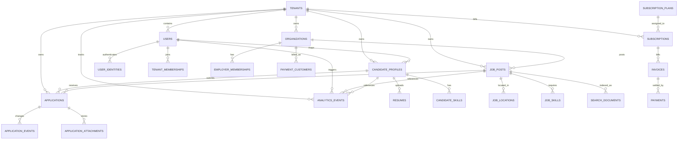

# AiClod PostgreSQL Database Schema

## 1. Objectives

This schema defines a **scalable, multi-tenant PostgreSQL design** for AiClod, covering:

- users and tenant membership,
- employers and recruiter teams,
- jobs and job publishing,
- applications and hiring workflow,
- subscriptions and payments,
- resumes and candidate profiles,
- search indexing support,
- analytics events and rollups.

The design favors:

- **third normal form (3NF)** for transactional tables,
- **tenant-aware indexing** for predictable SaaS performance,
- **append-only audit/event tables** for workflow traceability,
- **partition-ready analytics and activity tables**, and
- **clean separation** between transactional truth and denormalized read/search models.

---

## 2. Design Principles

### 2.1 Multi-Tenant Strategy

Recommended default:

- one PostgreSQL cluster,
- one logical application schema,
- **shared tables with `tenant_id` on tenant-owned data**, and
- optional PostgreSQL row-level security (RLS) for defense-in-depth.

This approach supports:
- low operational overhead for early growth,
- tenant-aware indexes,
- efficient cross-tenant operational administration, and
- future migration to dedicated schemas/databases for premium tenants.

### 2.2 Normalization Strategy

- **Reference/lookup values** live in lookup tables instead of hard-coded database enums where change frequency is expected.
- **Many-to-many relationships** are modeled with join tables.
- **Documents and media** are stored in object storage; PostgreSQL stores metadata and lifecycle state.
- **Search and analytics tables** are intentionally denormalized, but are downstream projections from normalized source tables.

### 2.3 PostgreSQL Features to Use

Recommended extensions and features:

- `pgcrypto` for UUID generation if needed.
- `citext` for case-insensitive email/domain handling.
- `pg_trgm` for fuzzy search support and admin tooling.
- `btree_gin` for mixed indexing support where beneficial.
- declarative partitioning for large fact and event tables.
- generated columns for derived search text and date bucketing where useful.

---

## 3. High-Level Domain Model



---

## 4. Schema Namespaces

Recommended logical grouping inside PostgreSQL:

- `core`: tenancy, users, memberships, organizations.
- `talent`: candidate profiles, resumes, skills.
- `hiring`: jobs, applications, workflows.
- `billing`: plans, subscriptions, invoices, payments.
- `search`: search projection tables and sync metadata.
- `analytics`: events, rollups, reporting models.
- `audit`: immutable security and admin audit entries.

If a single schema is preferred for simplicity, keep table names prefixed logically, but the domain separation above should still guide ownership.

---

## 5. Core Tenancy and Identity Tables

### 5.1 `tenants`

Represents a customer account/workspace.

| Column | Type | Notes |
|---|---|---|
| id | uuid PK | stable tenant identifier |
| slug | citext UNIQUE | URL-safe tenant key |
| name | text | display name |
| status | text | active, suspended, archived |
| billing_email | citext | finance contact |
| timezone | text | tenant default timezone |
| default_locale | text | localization default |
| settings_json | jsonb | non-critical tenant configuration |
| created_at | timestamptz | |
| updated_at | timestamptz | |
| deleted_at | timestamptz NULL | soft delete marker |

**Indexes**
- unique index on `slug`
- index on `(status, created_at desc)`
- partial index on `(deleted_at)` where `deleted_at is null`

### 5.2 `users`

Global user identity, independent of tenant membership.

| Column | Type | Notes |
|---|---|---|
| id | uuid PK | user identifier |
| primary_email | citext UNIQUE | login/contact email |
| email_verified_at | timestamptz NULL | |
| full_name | text | |
| avatar_asset_id | uuid NULL | object storage metadata reference |
| status | text | invited, active, disabled |
| last_login_at | timestamptz NULL | |
| created_at | timestamptz | |
| updated_at | timestamptz | |

**Indexes**
- unique index on `primary_email`
- index on `(status, last_login_at desc)`

### 5.3 `user_identities`

Maps a user to external identity providers such as Keycloak, Google, LinkedIn, or enterprise SSO.

| Column | Type | Notes |
|---|---|---|
| id | uuid PK | |
| user_id | uuid FK -> users.id | |
| provider | text | keycloak, google, linkedin, saml |
| provider_subject | text | subject from IdP |
| provider_email | citext NULL | |
| metadata_json | jsonb | raw claims snapshot |
| created_at | timestamptz | |

**Constraints / indexes**
- unique `(provider, provider_subject)`
- index `(user_id, provider)`

### 5.4 `tenant_memberships`

Links a user to a tenant with platform permissions.

| Column | Type | Notes |
|---|---|---|
| id | uuid PK | |
| tenant_id | uuid FK -> tenants.id | |
| user_id | uuid FK -> users.id | |
| role_code | text FK -> role_definitions.code | tenant_admin, recruiter, hiring_manager, candidate |
| status | text | invited, active, revoked |
| invited_by_user_id | uuid NULL FK -> users.id | |
| joined_at | timestamptz NULL | |
| created_at | timestamptz | |

**Constraints / indexes**
- unique `(tenant_id, user_id)`
- index `(tenant_id, role_code, status)`
- index `(user_id, status)`

### 5.5 `role_definitions`

Reference table for roles rather than PostgreSQL enums.

| Column | Type | Notes |
|---|---|---|
| code | text PK | role key |
| scope | text | tenant, org, system |
| description | text | |

---

## 6. Employer and Organization Tables

### 6.1 `organizations`

Represents an employer/customer company inside a tenant.

| Column | Type | Notes |
|---|---|---|
| id | uuid PK | |
| tenant_id | uuid FK -> tenants.id | |
| legal_name | text | |
| display_name | text | |
| slug | citext | unique per tenant |
| website_url | text NULL | |
| industry_code | text NULL | lookup-driven |
| size_band_code | text NULL | lookup-driven |
| description | text NULL | |
| logo_asset_id | uuid NULL | file metadata reference |
| headquarters_location_id | uuid NULL FK -> geo_locations.id | |
| created_at | timestamptz | |
| updated_at | timestamptz | |

**Constraints / indexes**
- unique `(tenant_id, slug)`
- index `(tenant_id, created_at desc)`
- index `(tenant_id, legal_name)`

### 6.2 `employer_memberships`

Maps users into organization-specific teams.

| Column | Type | Notes |
|---|---|---|
| id | uuid PK | |
| tenant_id | uuid FK -> tenants.id | |
| organization_id | uuid FK -> organizations.id | |
| user_id | uuid FK -> users.id | |
| role_code | text | recruiter, hiring_manager, coordinator |
| is_default | boolean | |
| created_at | timestamptz | |

**Constraints / indexes**
- unique `(organization_id, user_id, role_code)`
- index `(tenant_id, user_id)`
- index `(tenant_id, organization_id, role_code)`

### 6.3 `payment_customers`

Billing identity per organization or tenant.

| Column | Type | Notes |
|---|---|---|
| id | uuid PK | |
| tenant_id | uuid FK -> tenants.id | |
| organization_id | uuid NULL FK -> organizations.id | nullable if billing at tenant level |
| external_customer_ref | text | billing gateway customer key |
| created_at | timestamptz | |

**Indexes**
- unique `(tenant_id, organization_id)` where `organization_id is not null`
- unique `(tenant_id)` where `organization_id is null`
- unique `(external_customer_ref)`

---

## 7. Candidate and Resume Tables

### 7.1 `candidate_profiles`

Candidate-specific profile inside a tenant marketplace context.

| Column | Type | Notes |
|---|---|---|
| id | uuid PK | |
| tenant_id | uuid FK -> tenants.id | |
| user_id | uuid FK -> users.id | one user may have multiple tenant-specific profiles if needed |
| headline | text NULL | |
| summary | text NULL | |
| total_experience_months | integer NULL | |
| current_location_id | uuid NULL FK -> geo_locations.id | |
| work_authorization_code | text NULL | |
| visibility | text | private, tenant_visible, public |
| open_to_work | boolean | |
| salary_currency | char(3) NULL | ISO 4217 |
| salary_min | numeric(12,2) NULL | |
| salary_max | numeric(12,2) NULL | |
| created_at | timestamptz | |
| updated_at | timestamptz | |

**Constraints / indexes**
- unique `(tenant_id, user_id)`
- index `(tenant_id, visibility, open_to_work)`
- index `(tenant_id, updated_at desc)`

### 7.2 `resumes`

Metadata for uploaded resume files and extracted text/parsing state.

| Column | Type | Notes |
|---|---|---|
| id | uuid PK | |
| tenant_id | uuid FK -> tenants.id | |
| candidate_profile_id | uuid FK -> candidate_profiles.id | |
| storage_bucket | text | object storage bucket |
| storage_key | text | object storage object key |
| file_name | text | |
| mime_type | text | |
| file_size_bytes | bigint | |
| checksum_sha256 | text | deduplication support |
| is_primary | boolean | |
| parse_status | text | pending, processing, parsed, failed |
| parsed_text | text NULL | optional fallback storage for extracted text |
| parsed_json | jsonb NULL | structured parser output |
| uploaded_at | timestamptz | |
| deleted_at | timestamptz NULL | |

**Constraints / indexes**
- unique partial index on `(candidate_profile_id)` where `is_primary is true and deleted_at is null`
- index `(tenant_id, candidate_profile_id, uploaded_at desc)`
- index `(tenant_id, parse_status)`
- unique `(checksum_sha256)` if global dedupe is desired, otherwise `(tenant_id, checksum_sha256)`

### 7.3 `skills`

Canonical skill catalog.

| Column | Type | Notes |
|---|---|---|
| id | bigserial PK | |
| normalized_name | citext UNIQUE | canonical skill name |
| category_code | text NULL | engineering, design, finance |
| created_at | timestamptz | |

### 7.4 `candidate_skills`

Many-to-many between candidate profiles and skills.

| Column | Type | Notes |
|---|---|---|
| candidate_profile_id | uuid FK -> candidate_profiles.id | |
| skill_id | bigint FK -> skills.id | |
| proficiency_code | text NULL | beginner, intermediate, expert |
| years_experience | numeric(4,1) NULL | |
| last_used_at | date NULL | |

**Primary key**
- `(candidate_profile_id, skill_id)`

**Indexes**
- index `(skill_id, proficiency_code)`

### 7.5 `candidate_experiences`

Normalized work history entries.

| Column | Type | Notes |
|---|---|---|
| id | uuid PK | |
| candidate_profile_id | uuid FK -> candidate_profiles.id | |
| employer_name | text | |
| title | text | |
| employment_type_code | text NULL | |
| start_date | date | |
| end_date | date NULL | null = current |
| description | text NULL | |
| location_id | uuid NULL FK -> geo_locations.id | |
| sort_order | integer | presentation order |

**Indexes**
- index `(candidate_profile_id, start_date desc)`

### 7.6 `candidate_educations`

Normalized education records.

| Column | Type | Notes |
|---|---|---|
| id | uuid PK | |
| candidate_profile_id | uuid FK -> candidate_profiles.id | |
| institution_name | text | |
| degree_name | text NULL | |
| field_of_study | text NULL | |
| start_date | date NULL | |
| end_date | date NULL | |
| grade_text | text NULL | |

---

## 8. Job Posting Tables

### 8.1 `job_posts`

Primary job requisition and posting record.

| Column | Type | Notes |
|---|---|---|
| id | uuid PK | |
| tenant_id | uuid FK -> tenants.id | |
| organization_id | uuid FK -> organizations.id | |
| created_by_user_id | uuid FK -> users.id | |
| title | text | |
| job_code | text NULL | employer/internal reference |
| employment_type_code | text | full_time, contract, internship |
| workplace_type_code | text | remote, hybrid, onsite |
| status | text | draft, pending_approval, published, paused, closed, archived |
| visibility | text | public, private, invite_only |
| description_markdown | text | canonical source |
| description_html | text NULL | rendered cache |
| responsibilities_text | text NULL | |
| requirements_text | text NULL | |
| salary_currency | char(3) NULL | |
| salary_min | numeric(12,2) NULL | |
| salary_max | numeric(12,2) NULL | |
| openings_count | integer | |
| apply_url | text NULL | external apply support |
| publish_at | timestamptz NULL | |
| close_at | timestamptz NULL | |
| created_at | timestamptz | |
| updated_at | timestamptz | |
| deleted_at | timestamptz NULL | |

**Constraints / indexes**
- unique `(tenant_id, organization_id, job_code)` where `job_code is not null`
- index `(tenant_id, status, publish_at desc)`
- index `(tenant_id, organization_id, status)`
- index `(tenant_id, created_by_user_id, created_at desc)`
- partial index `(tenant_id, publish_at desc)` where `status = 'published' and deleted_at is null`

### 8.2 `geo_locations`

Reusable normalized location table for candidates, organizations, and jobs.

| Column | Type | Notes |
|---|---|---|
| id | uuid PK | |
| country_code | char(2) | ISO 3166-1 |
| region_code | text NULL | state/province |
| city | text NULL | |
| postal_code | text NULL | |
| latitude | numeric(9,6) NULL | |
| longitude | numeric(9,6) NULL | |
| timezone | text NULL | |
| formatted_text | text | canonical display value |

**Indexes**
- index `(country_code, region_code, city)`

### 8.3 `job_locations`

Supports multi-location jobs.

| Column | Type | Notes |
|---|---|---|
| job_post_id | uuid FK -> job_posts.id | |
| location_id | uuid FK -> geo_locations.id | |
| is_primary | boolean | |

**Primary key**
- `(job_post_id, location_id)`

**Indexes**
- index `(location_id, job_post_id)`

### 8.4 `job_skills`

Required/preferred skills for a job.

| Column | Type | Notes |
|---|---|---|
| job_post_id | uuid FK -> job_posts.id | |
| skill_id | bigint FK -> skills.id | |
| requirement_level | text | required, preferred |
| min_years_experience | numeric(4,1) NULL | |

**Primary key**
- `(job_post_id, skill_id, requirement_level)`

**Indexes**
- index `(skill_id, requirement_level)`

### 8.5 `job_publication_channels`

Tracks where the job is published.

| Column | Type | Notes |
|---|---|---|
| id | uuid PK | |
| tenant_id | uuid FK -> tenants.id | |
| job_post_id | uuid FK -> job_posts.id | |
| channel_code | text | careers_site, linkedin, indeed, api_partner |
| external_reference | text NULL | |
| publication_status | text | pending, published, failed, removed |
| last_synced_at | timestamptz NULL | |
| error_message | text NULL | |

**Indexes**
- unique `(job_post_id, channel_code)`
- index `(tenant_id, channel_code, publication_status)`

---

## 9. Application Tracking Tables

### 9.1 `application_stage_definitions`

Tenant-configurable hiring stages.

| Column | Type | Notes |
|---|---|---|
| id | uuid PK | |
| tenant_id | uuid FK -> tenants.id | |
| code | text | applied, screening, interview, offer, hired, rejected |
| display_name | text | |
| sequence_no | integer | |
| is_terminal | boolean | |
| created_at | timestamptz | |

**Indexes**
- unique `(tenant_id, code)`
- unique `(tenant_id, sequence_no)`

### 9.2 `applications`

One row per candidate-to-job application.

| Column | Type | Notes |
|---|---|---|
| id | uuid PK | |
| tenant_id | uuid FK -> tenants.id | |
| job_post_id | uuid FK -> job_posts.id | |
| candidate_profile_id | uuid FK -> candidate_profiles.id | |
| submitted_resume_id | uuid NULL FK -> resumes.id | |
| source_channel_code | text | direct, referral, import, syndication |
| current_stage_id | uuid FK -> application_stage_definitions.id | |
| status | text | active, withdrawn, hired, rejected |
| score_numeric | numeric(5,2) NULL | ranking or screening score |
| cover_letter_text | text NULL | |
| applied_at | timestamptz | |
| last_activity_at | timestamptz | |
| withdrawn_at | timestamptz NULL | |
| hired_at | timestamptz NULL | |
| rejected_at | timestamptz NULL | |
| created_at | timestamptz | |
| updated_at | timestamptz | |

**Constraints / indexes**
- unique `(tenant_id, job_post_id, candidate_profile_id)`
- index `(tenant_id, current_stage_id, last_activity_at desc)`
- index `(tenant_id, job_post_id, status, applied_at desc)`
- index `(tenant_id, candidate_profile_id, applied_at desc)`
- partial index `(tenant_id, status)` where `status = 'active'`

### 9.3 `application_events`

Immutable timeline of application changes.

| Column | Type | Notes |
|---|---|---|
| id | bigint generated always as identity PK | |
| tenant_id | uuid FK -> tenants.id | |
| application_id | uuid FK -> applications.id | |
| actor_user_id | uuid NULL FK -> users.id | system actions nullable |
| event_type | text | submitted, stage_changed, note_added, rejected |
| from_stage_id | uuid NULL FK -> application_stage_definitions.id | |
| to_stage_id | uuid NULL FK -> application_stage_definitions.id | |
| event_payload | jsonb | flexible event detail |
| created_at | timestamptz | |

**Scaling guidance**
- partition by month on `created_at` once event volume is large

**Indexes**
- index `(tenant_id, application_id, created_at desc)`
- index `(tenant_id, event_type, created_at desc)`
- GIN index on `event_payload` if event queries justify it

### 9.4 `application_attachments`

Attachments specific to the application, separate from profile resumes.

| Column | Type | Notes |
|---|---|---|
| id | uuid PK | |
| tenant_id | uuid FK -> tenants.id | |
| application_id | uuid FK -> applications.id | |
| storage_bucket | text | |
| storage_key | text | |
| attachment_type | text | portfolio, cover_letter_file, assessment |
| file_name | text | |
| mime_type | text | |
| file_size_bytes | bigint | |
| uploaded_at | timestamptz | |

**Indexes**
- index `(tenant_id, application_id, uploaded_at desc)`

---

## 10. Subscription and Payment Tables

### 10.1 `subscription_plans`

Catalog of commercial plans.

| Column | Type | Notes |
|---|---|---|
| id | uuid PK | |
| code | text UNIQUE | starter, growth, enterprise |
| display_name | text | |
| billing_interval | text | monthly, annual |
| currency_code | char(3) | |
| base_price | numeric(12,2) | |
| quotas_json | jsonb | job limits, recruiter seats, plugin access |
| is_active | boolean | |
| created_at | timestamptz | |

### 10.2 `subscriptions`

Tenant billing agreement.

| Column | Type | Notes |
|---|---|---|
| id | uuid PK | |
| tenant_id | uuid FK -> tenants.id | |
| plan_id | uuid FK -> subscription_plans.id | |
| payment_customer_id | uuid FK -> payment_customers.id | |
| status | text | trialing, active, past_due, canceled |
| trial_ends_at | timestamptz NULL | |
| current_period_start | timestamptz | |
| current_period_end | timestamptz | |
| cancel_at_period_end | boolean | |
| canceled_at | timestamptz NULL | |
| external_subscription_ref | text NULL | gateway subscription ID |
| created_at | timestamptz | |
| updated_at | timestamptz | |

**Indexes**
- unique partial index `(tenant_id)` where `status in ('trialing','active','past_due')`
- index `(tenant_id, status)`
- index `(current_period_end, status)`

### 10.3 `invoices`

Billing periods and charges.

| Column | Type | Notes |
|---|---|---|
| id | uuid PK | |
| tenant_id | uuid FK -> tenants.id | |
| subscription_id | uuid FK -> subscriptions.id | |
| invoice_number | text | human-readable invoice number |
| status | text | draft, open, paid, void, uncollectible |
| currency_code | char(3) | |
| subtotal_amount | numeric(12,2) | |
| tax_amount | numeric(12,2) | |
| total_amount | numeric(12,2) | |
| due_at | timestamptz NULL | |
| issued_at | timestamptz | |
| paid_at | timestamptz NULL | |
| external_invoice_ref | text NULL | |
| created_at | timestamptz | |

**Indexes**
- unique `(tenant_id, invoice_number)`
- index `(tenant_id, status, issued_at desc)`
- index `(subscription_id, issued_at desc)`

### 10.4 `payments`

Payment attempts and settlements.

| Column | Type | Notes |
|---|---|---|
| id | uuid PK | |
| tenant_id | uuid FK -> tenants.id | |
| invoice_id | uuid FK -> invoices.id | |
| payment_provider_code | text | stripe, adyen, manual |
| provider_payment_ref | text NULL | |
| status | text | pending, succeeded, failed, refunded |
| amount | numeric(12,2) | |
| currency_code | char(3) | |
| failure_reason | text NULL | |
| processed_at | timestamptz NULL | |
| created_at | timestamptz | |

**Indexes**
- unique `(payment_provider_code, provider_payment_ref)` where `provider_payment_ref is not null`
- index `(tenant_id, status, created_at desc)`
- index `(invoice_id, status)`

### 10.5 `payment_events`

Immutable billing gateway event capture.

| Column | Type | Notes |
|---|---|---|
| id | bigint generated always as identity PK | |
| tenant_id | uuid NULL FK -> tenants.id | nullable until mapped |
| provider_code | text | |
| external_event_ref | text | |
| event_type | text | |
| payload_json | jsonb | raw webhook payload |
| received_at | timestamptz | |
| processed_at | timestamptz NULL | |

**Indexes**
- unique `(provider_code, external_event_ref)`
- index `(provider_code, event_type, received_at desc)`

---

## 11. Search Projection Tables

Transactional truth stays normalized. Search-friendly read models live separately.

### 11.1 `search_documents`

Projection source used to synchronize OpenSearch and provide PostgreSQL fallback search.

| Column | Type | Notes |
|---|---|---|
| id | uuid PK | same as aggregate ID when possible |
| tenant_id | uuid FK -> tenants.id | |
| entity_type | text | job_post, candidate_profile, organization |
| entity_id | uuid | source aggregate ID |
| title | text | |
| subtitle | text NULL | |
| body_text | text | normalized searchable text |
| facets_json | jsonb | employment type, location, salary bands |
| keywords_tsv | tsvector | PostgreSQL fallback FTS vector |
| source_updated_at | timestamptz | latest source change time |
| indexed_at | timestamptz NULL | last successful external index sync |
| sync_status | text | pending, synced, failed |
| sync_error | text NULL | |
| created_at | timestamptz | |
| updated_at | timestamptz | |

**Constraints / indexes**
- unique `(tenant_id, entity_type, entity_id)`
- GIN index on `keywords_tsv`
- GIN index on `facets_json jsonb_path_ops`
- index `(tenant_id, entity_type, sync_status, updated_at)`
- index `(tenant_id, indexed_at)`

### 11.2 `search_sync_runs`

Operational visibility for indexing jobs.

| Column | Type | Notes |
|---|---|---|
| id | uuid PK | |
| tenant_id | uuid NULL FK -> tenants.id | global or tenant-specific run |
| entity_type | text | |
| started_at | timestamptz | |
| completed_at | timestamptz NULL | |
| documents_processed | integer | |
| documents_failed | integer | |
| status | text | running, succeeded, failed |
| error_summary | text NULL | |

**Indexes**
- index `(tenant_id, entity_type, started_at desc)`

---

## 12. Analytics Schema

Analytics should not overload transactional queries. Use append-only facts plus aggregated rollups.

### 12.1 `analytics_events`

Primary event table for product analytics, reporting, and BI export.

| Column | Type | Notes |
|---|---|---|
| id | bigint generated always as identity | partition key candidate |
| tenant_id | uuid FK -> tenants.id | |
| event_date | date GENERATED ALWAYS AS (`occurred_at`::date) STORED | partition-friendly |
| occurred_at | timestamptz | |
| actor_user_id | uuid NULL FK -> users.id | |
| actor_type | text | candidate, recruiter, system |
| event_name | text | job_viewed, application_started, application_submitted |
| entity_type | text NULL | job_post, application, tenant |
| entity_id | uuid NULL | |
| session_id | uuid NULL | |
| request_id | uuid NULL | traceable API correlation |
| properties_json | jsonb | flexible dimensions |
| numeric_value | numeric(14,2) NULL | optional metric payload |

**Primary key**
- `(id, event_date)` for partitioned layouts, or just `id` for non-partitioned early stage

**Partitioning**
- monthly partitions on `event_date`

**Indexes**
- index `(tenant_id, event_date, event_name)`
- index `(tenant_id, entity_type, entity_id, occurred_at desc)`
- index `(actor_user_id, occurred_at desc)` where `actor_user_id is not null`
- GIN index on `properties_json` only if ad hoc event exploration is frequent

### 12.2 `tenant_daily_metrics`

Rollup for dashboards.

| Column | Type | Notes |
|---|---|---|
| tenant_id | uuid FK -> tenants.id | |
| metric_date | date | |
| jobs_published_count | integer | |
| applications_submitted_count | integer | |
| active_candidates_count | integer | |
| paid_subscriptions_count | integer | |
| mrr_amount | numeric(14,2) | |
| created_at | timestamptz | |
| updated_at | timestamptz | |

**Primary key**
- `(tenant_id, metric_date)`

### 12.3 `job_daily_metrics`

Rollup for job performance.

| Column | Type | Notes |
|---|---|---|
| job_post_id | uuid FK -> job_posts.id | |
| tenant_id | uuid FK -> tenants.id | |
| metric_date | date | |
| views_count | integer | |
| applies_started_count | integer | |
| applies_completed_count | integer | |
| unique_candidate_count | integer | |
| created_at | timestamptz | |
| updated_at | timestamptz | |

**Primary key**
- `(job_post_id, metric_date)`

**Indexes**
- index `(tenant_id, metric_date desc)`

### 12.4 `subscription_daily_metrics`

Rollup for commercial analytics.

| Column | Type | Notes |
|---|---|---|
| tenant_id | uuid FK -> tenants.id | |
| metric_date | date | |
| active_seat_count | integer | |
| active_job_slots | integer | |
| invoice_total_amount | numeric(14,2) | |
| payment_success_amount | numeric(14,2) | |
| payment_failure_count | integer | |
| created_at | timestamptz | |
| updated_at | timestamptz | |

**Primary key**
- `(tenant_id, metric_date)`

---

## 13. Audit and Compliance Tables

### 13.1 `audit_log_entries`

Immutable operational audit log.

| Column | Type | Notes |
|---|---|---|
| id | bigint generated always as identity PK | |
| tenant_id | uuid NULL FK -> tenants.id | nullable for system actions |
| actor_user_id | uuid NULL FK -> users.id | |
| actor_type | text | user, system, plugin |
| action_code | text | user.invited, job.published, payment.refunded |
| entity_type | text | |
| entity_id | uuid NULL | |
| ip_address | inet NULL | |
| user_agent | text NULL | |
| payload_json | jsonb | structured audit details |
| created_at | timestamptz | |

**Scaling guidance**
- partition by month on `created_at`

**Indexes**
- index `(tenant_id, created_at desc)`
- index `(entity_type, entity_id, created_at desc)`
- index `(actor_user_id, created_at desc)` where `actor_user_id is not null`

---

## 14. Example DDL Skeleton

The following SQL is intentionally partial, but demonstrates the recommended shape.

```sql
create table tenants (
    id uuid primary key,
    slug citext not null unique,
    name text not null,
    status text not null,
    billing_email citext,
    timezone text not null default 'UTC',
    default_locale text not null default 'en-US',
    settings_json jsonb not null default '{}'::jsonb,
    created_at timestamptz not null default now(),
    updated_at timestamptz not null default now(),
    deleted_at timestamptz
);

create table users (
    id uuid primary key,
    primary_email citext not null unique,
    email_verified_at timestamptz,
    full_name text not null,
    avatar_asset_id uuid,
    status text not null,
    last_login_at timestamptz,
    created_at timestamptz not null default now(),
    updated_at timestamptz not null default now()
);

create table organizations (
    id uuid primary key,
    tenant_id uuid not null references tenants(id),
    legal_name text not null,
    display_name text not null,
    slug citext not null,
    website_url text,
    industry_code text,
    size_band_code text,
    description text,
    logo_asset_id uuid,
    headquarters_location_id uuid,
    created_at timestamptz not null default now(),
    updated_at timestamptz not null default now(),
    unique (tenant_id, slug)
);

create table candidate_profiles (
    id uuid primary key,
    tenant_id uuid not null references tenants(id),
    user_id uuid not null references users(id),
    headline text,
    summary text,
    total_experience_months integer,
    current_location_id uuid,
    work_authorization_code text,
    visibility text not null,
    open_to_work boolean not null default false,
    salary_currency char(3),
    salary_min numeric(12,2),
    salary_max numeric(12,2),
    created_at timestamptz not null default now(),
    updated_at timestamptz not null default now(),
    unique (tenant_id, user_id)
);

create table job_posts (
    id uuid primary key,
    tenant_id uuid not null references tenants(id),
    organization_id uuid not null references organizations(id),
    created_by_user_id uuid not null references users(id),
    title text not null,
    job_code text,
    employment_type_code text not null,
    workplace_type_code text not null,
    status text not null,
    visibility text not null,
    description_markdown text not null,
    description_html text,
    responsibilities_text text,
    requirements_text text,
    salary_currency char(3),
    salary_min numeric(12,2),
    salary_max numeric(12,2),
    openings_count integer not null default 1,
    apply_url text,
    publish_at timestamptz,
    close_at timestamptz,
    created_at timestamptz not null default now(),
    updated_at timestamptz not null default now(),
    deleted_at timestamptz,
    unique (tenant_id, organization_id, job_code)
);

create table applications (
    id uuid primary key,
    tenant_id uuid not null references tenants(id),
    job_post_id uuid not null references job_posts(id),
    candidate_profile_id uuid not null references candidate_profiles(id),
    submitted_resume_id uuid references resumes(id),
    source_channel_code text not null,
    current_stage_id uuid not null references application_stage_definitions(id),
    status text not null,
    score_numeric numeric(5,2),
    cover_letter_text text,
    applied_at timestamptz not null default now(),
    last_activity_at timestamptz not null default now(),
    withdrawn_at timestamptz,
    hired_at timestamptz,
    rejected_at timestamptz,
    created_at timestamptz not null default now(),
    updated_at timestamptz not null default now(),
    unique (tenant_id, job_post_id, candidate_profile_id)
);

create index idx_job_posts_tenant_status_publish
    on job_posts (tenant_id, status, publish_at desc);

create index idx_applications_tenant_job_status_applied
    on applications (tenant_id, job_post_id, status, applied_at desc);

create index idx_applications_tenant_candidate_applied
    on applications (tenant_id, candidate_profile_id, applied_at desc);
```

---

## 15. Indexing Strategy Summary

### 15.1 Tenant-First Composite Indexing

For almost every tenant-owned transactional table, use composite indexes that start with `tenant_id`.

Examples:
- `(tenant_id, status, created_at desc)`
- `(tenant_id, organization_id, status)`
- `(tenant_id, current_stage_id, last_activity_at desc)`
- `(tenant_id, event_date, event_name)`

This ensures PostgreSQL can quickly prune irrelevant tenant rows before filtering further.

### 15.2 Partial Indexes

Use partial indexes for high-selectivity states:

- published jobs only,
- active subscriptions only,
- primary resume only,
- active applications only,
- non-deleted records only.

### 15.3 GIN / Full-Text Indexes

Use GIN indexes selectively on:
- `search_documents.keywords_tsv`
- `search_documents.facets_json`
- `analytics_events.properties_json` only when query patterns justify it
- `application_events.event_payload` only for operator tooling needs

### 15.4 Partitioning Targets

Partition tables that grow continuously and are rarely updated:
- `analytics_events`
- `application_events`
- `audit_log_entries`
- potentially `payment_events`

---

## 16. Multi-Tenant Readiness Checklist

To ensure real multi-tenant safety:

1. Every tenant-owned table includes `tenant_id`.
2. Repository queries always filter by `tenant_id`.
3. Cross-tenant uniqueness uses composite unique keys when needed.
4. RLS may enforce `tenant_id = current_setting('app.tenant_id')::uuid` in sensitive environments.
5. Search projections must include `tenant_id` and be filtered during indexing and querying.
6. Analytics events must include `tenant_id` so rollups remain tenant-safe.
7. Object storage keys should be tenant-prefixed, for example `tenant/{tenant_id}/resume/{resume_id}`.

---

## 17. Operational Recommendations

- Use **UUID primary keys** for distributed-safe identifiers exposed externally.
- Use **identity/bigint keys** only for append-only internal event streams if desired for storage efficiency.
- Add **`created_at` and `updated_at`** to all mutable tables.
- Use **soft deletes** only where recovery/business history matters; otherwise hard-delete child records in controlled workflows.
- Keep **payment webhook payloads**, **resume parsing payloads**, and **audit payloads** in JSONB, but avoid making core transactional tables overly document-oriented.
- Keep transactional PostgreSQL query paths separate from OpenSearch query paths.
- Feed analytics from domain events or CDC rather than expensive live aggregations on OLTP tables.

---

## 18. Recommended Implementation Order

1. `tenants`, `users`, `user_identities`, `tenant_memberships`
2. `organizations`, `employer_memberships`
3. `candidate_profiles`, `resumes`, `skills`, `candidate_skills`
4. `job_posts`, `job_locations`, `job_skills`, `job_publication_channels`
5. `application_stage_definitions`, `applications`, `application_events`
6. `subscription_plans`, `payment_customers`, `subscriptions`, `invoices`, `payments`, `payment_events`
7. `search_documents`, `search_sync_runs`
8. `analytics_events`, `tenant_daily_metrics`, `job_daily_metrics`, `subscription_daily_metrics`
9. `audit_log_entries`

This order delivers AiClod’s core hiring workflow first, then commercial controls, then search and analytics acceleration layers.
