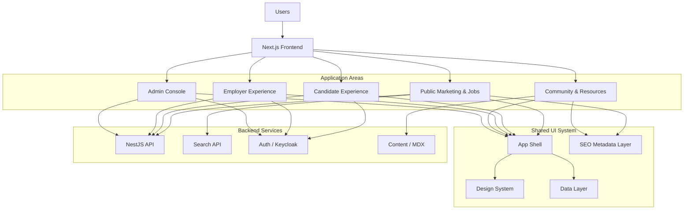

# AiClod Next.js Frontend Architecture

## 1. Purpose

This document defines the **frontend architecture** for AiClod using **Next.js** with a clean, modern user experience inspired by large-scale job portals such as Naukri-style platforms, while keeping the interface more modular, accessible, and productized for a SaaS environment.

It covers:

- page architecture,
- reusable UI components,
- SSR and SEO strategy,
- candidate and employer dashboards,
- admin experience,
- design-system and state-management structure.

---

## 2. Experience Goals

AiClod’s frontend should feel:

- **fast** for public job discovery,
- **clean and modern** for candidate and employer workflows,
- **trustworthy** for payments, applications, and profile management,
- **content-rich** for community and resources,
- **operationally efficient** for administrators.

### 2.1 Naukri-Style Inspiration, Modernized

The UI should borrow proven marketplace patterns from established job portals:

- large search-first homepage,
- high-density but readable job result lists,
- rich job detail pages with clear apply actions,
- profile completion prompts,
- dashboard cards for status and recommendations,
- content sections for career resources and community.

But it should modernize the experience with:

- stronger visual hierarchy,
- cleaner spacing,
- reusable card and filter systems,
- responsive layout behavior,
- improved accessibility and SEO.

---

## 3. Frontend Technology Baseline

| Concern | Recommendation |
|---|---|
| Framework | Next.js App Router |
| Language | TypeScript |
| Styling | Tailwind CSS + design tokens |
| Components | Headless UI / Radix primitives + custom design system |
| Data fetching | Server Components + route handlers + TanStack Query where client caching is needed |
| Forms | React Hook Form + Zod |
| Tables/Grids | TanStack Table |
| Charts | Recharts or Apache ECharts |
| Rich content | MDX for resources/community/editorial content |
| Icons | Lucide Icons |
| i18n-ready | next-intl or equivalent |

This combination supports fast rendering, maintainability, and a component-first design system.

---

## 3.1 Global UX Requirements

The frontend should be internationalization-ready by default:

- locale-aware routing for public pages, candidate dashboards, and employer tools,
- currency-aware price and salary formatting using ISO currency codes,
- timezone-aware rendering for interview schedules, reminders, and analytics windows,
- translated communication preferences and notification settings, and
- bidirectional layout support for RTL locales such as Arabic.

The web app should expose a locale switcher, remember user overrides, and degrade gracefully to the tenant default locale.

---

## 3.2 AI Experience Requirements

The frontend should present AI outputs as assistive guidance with clear provenance. Recommended surfaces include personalized job recommendation rails, resume match summaries, skill-gap cards, recruiter forecast dashboards, and chatbot entry points with escalation states.

---

## 4. High-Level Frontend Architecture



---

## 5. App Router Structure

Recommended Next.js `app/` structure:

```text
app/
  (marketing)/
    page.tsx
    jobs/
      page.tsx
      [jobSlug]/
        page.tsx
    community/
      page.tsx
      [slug]/
        page.tsx
    resources/
      page.tsx
      [slug]/
        page.tsx
  (candidate)/
    dashboard/
      page.tsx
      profile/
        page.tsx
      applications/
        page.tsx
      saved-jobs/
        page.tsx
      notifications/
        page.tsx
  (employer)/
    employer/
      dashboard/
        page.tsx
      jobs/
        page.tsx
      jobs/new/
        page.tsx
      jobs/[jobId]/
        page.tsx
      applicants/
        page.tsx
      company/
        page.tsx
      billing/
        page.tsx
  (admin)/
    admin/
      page.tsx
      tenants/
        page.tsx
      users/
        page.tsx
      jobs/
        page.tsx
      content/
        page.tsx
      plugins/
        page.tsx
      analytics/
        page.tsx
  api/
    preview/
      route.ts
components/
features/
lib/
styles/
content/
```

### 5.1 Layout Segments

Use route groups to split major experiences:

- `(marketing)` for SEO-facing pages,
- `(candidate)` for authenticated user dashboard flows,
- `(employer)` for recruiter/employer SaaS tools,
- `(admin)` for platform operations.

Each route group can define its own layout, navigation, guards, and shell behavior.

---

## 6. Core Pages and UX Design

## 6.1 Homepage

**Goals**
- capture search intent immediately,
- present trust signals and popular categories,
- drive candidates into job discovery,
- drive employers into posting and dashboard journeys.

**Sections**
- top navigation with candidate/employer/admin awareness,
- hero with large search box,
- quick filters (location, experience, remote, salary),
- featured companies,
- trending job categories,
- featured jobs carousel/grid,
- resume/profile CTA,
- employer CTA banner,
- community/resources highlights,
- footer with SEO links.

**Design notes**
- white or soft-neutral base background,
- accent color reserved for CTA and active states,
- search bar should be visually dominant,
- sections should feel modular and card-based.

## 6.2 Job Search Page

**Goals**
- high-density discovery experience,
- fast filtering,
- excellent mobile and desktop behavior,
- SEO-friendly paginated route strategy.

**Layout**
- left filter rail on desktop,
- sticky top bar for sort and applied filters,
- result cards in the main column,
- optional right rail for ads/resources/recommended jobs on wide screens.

**Core features**
- keyword search,
- location search,
- remote/hybrid/onsite filters,
- salary range filter,
- experience filter,
- employment type,
- company filter,
- saved search functionality,
- pagination or infinite scroll with crawlable page URLs.

**Design notes**
- cards should show title, company, location, salary, tags, freshness, and quick-save.
- visual density should feel information-rich without appearing cluttered.

## 6.3 Job Details Page

**Goals**
- maximize apply conversion,
- present job information clearly,
- support schema markup and SEO.

**Layout**
- top summary card with title/company/location/apply button,
- sticky apply panel on desktop,
- detail sections: overview, responsibilities, requirements, benefits, company info,
- related jobs and company jobs,
- recruiter/company credibility indicators.

**Core features**
- quick apply,
- save job,
- share job,
- report job,
- employer/company summary,
- structured breadcrumbs.

## 6.4 Candidate Dashboard

**Goals**
- show progress, recommendations, and action items.

**Views**
- dashboard home,
- profile completion,
- applications tracker,
- saved jobs,
- notifications,
- preferences.

**Widgets**
- profile completion card,
- recommended jobs,
- application status timeline summary,
- resume health score,
- alerts and reminders.

## 6.5 Employer Dashboard

**Goals**
- simplify hiring operations and job performance review.

**Views**
- employer dashboard home,
- job list,
- job creation/editing,
- applicants pipeline,
- company profile,
- billing/subscription,
- analytics summary.

**Widgets**
- open jobs count,
- active applicants count,
- hiring funnel charts,
- subscription usage/limits,
- recommended actions.

## 6.6 Community Page

**Goals**
- build engagement beyond transactions,
- support user-generated or editorial career content.

**Sections**
- featured discussions,
- popular topics,
- expert posts,
- community questions,
- trending conversations.

## 6.7 Resources Page

**Goals**
- create SEO-rich editorial acquisition,
- improve user retention with helpful content.

**Sections**
- interview prep,
- resume advice,
- salary guides,
- career growth articles,
- employer hiring playbooks.

## 6.8 Admin Console

**Goals**
- operational control without exposing consumer-facing visual complexity.

**Views**
- tenant management,
- user management,
- job moderation,
- plugin management,
- content moderation,
- billing oversight,
- support/audit tools,
- system health dashboards.

---

## 7. Layout and Navigation System

### 7.1 Global Shells

Define separate shells:

- `MarketingShell`
- `CandidateDashboardShell`
- `EmployerDashboardShell`
- `AdminShell`

### 7.2 Navigation Patterns

**Marketing shell**
- logo,
- job search link,
- community,
- resources,
- employer CTA,
- sign in / register,
- mobile drawer.

**Candidate shell**
- overview,
- applications,
- saved jobs,
- profile,
- notifications,
- account menu.

**Employer shell**
- dashboard,
- jobs,
- applicants,
- company,
- billing,
- analytics,
- team menu.

**Admin shell**
- tenants,
- users,
- jobs,
- plugins,
- content,
- analytics,
- audit.

### 7.3 Layout Principles

- preserve consistent max-width containers,
- use sticky headers and sidebars where helpful,
- keep primary CTA visible,
- ensure mobile-first collapse behavior,
- avoid layout shift across route transitions.

---

## 8. Reusable Component System

### 8.1 Foundation Components

- `Container`
- `Stack`
- `Grid`
- `SectionHeader`
- `Card`
- `Badge`
- `Button`
- `IconButton`
- `Divider`
- `EmptyState`
- `Skeleton`
- `Modal`
- `Drawer`
- `Tabs`
- `Dropdown`
- `Tooltip`
- `Pagination`

### 8.2 Search and Job Components

- `HeroSearchBar`
- `KeywordInput`
- `LocationAutocomplete`
- `FilterSidebar`
- `AppliedFiltersBar`
- `JobCard`
- `JobList`
- `JobDetailHeader`
- `JobHighlights`
- `CompanyCard`
- `RelatedJobsCarousel`
- `SaveJobButton`

### 8.3 Candidate Components

- `ProfileCompletionCard`
- `ResumeUploadCard`
- `ApplicationStatusTimeline`
- `SavedJobsTable`
- `RecommendedJobsPanel`
- `ResumeScoreWidget`

### 8.4 Employer Components

- `EmployerStatsCard`
- `ApplicantsPipelineBoard`
- `JobPerformanceChart`
- `CreateJobWizard`
- `CandidateMiniCard`
- `SubscriptionUsageCard`

### 8.5 Admin Components

- `AdminDataTable`
- `StatusPill`
- `AuditLogViewer`
- `TenantOverviewPanel`
- `PluginHealthTable`
- `ModerationQueuePanel`

### 8.6 Content Components

- `ArticleCard`
- `TopicChip`
- `AuthorBadge`
- `CommunityPostCard`
- `NewsletterSignupCard`

---

## 9. Feature-Based Component Ownership

Recommended structure:

```text
components/
  ui/
  layout/
  charts/
features/
  jobs/
    components/
    hooks/
    api/
    types/
  dashboard/
    candidate/
    employer/
  community/
  resources/
  admin/
  auth/
```

Rules:
- `components/ui` contains low-level reusable building blocks.
- `components/layout` contains headers, sidebars, page shells.
- `features/*/components` contains domain-specific components.
- page files compose feature sections instead of embedding all UI logic inline.

---

## 10. SSR, Rendering Strategy, and SEO

### 10.1 Rendering Strategy by Page Type

| Page Type | Rendering Strategy | Reason |
|---|---|---|
| Homepage | SSR / ISR | SEO + fast first paint for hero and featured jobs |
| Job search listing | SSR with cache/revalidation | crawlable search entry points and fast indexed content |
| Job detail page | SSR + metadata generation | best SEO and social sharing |
| Community landing | ISR | content-heavy and mostly read-oriented |
| Resource article pages | ISR / static generation | evergreen editorial SEO |
| Candidate dashboard | authenticated server rendering + client hydration | private personalized data |
| Employer dashboard | authenticated server rendering + client hydration | private business workflows |
| Admin pages | server rendering with strict auth | secure operations UI |

### 10.2 SEO Requirements

For SEO-facing routes, implement:

- dynamic metadata via `generateMetadata`,
- canonical URLs,
- Open Graph and Twitter card tags,
- breadcrumb schema,
- job posting schema for job detail pages,
- sitemap generation,
- robots configuration,
- pagination metadata,
- content deduplication rules.

### 10.3 Job Posting Structured Data

Job detail pages should emit JSON-LD with:
- job title,
- hiring organization,
- location,
- description,
- employment type,
- salary range when available,
- valid through date,
- direct apply URL.

### 10.4 Performance SEO Considerations

- stream above-the-fold content where useful,
- optimize images with `next/image`,
- defer non-critical dashboard widgets,
- preload critical search UI assets,
- limit blocking third-party scripts.

---

## 11. Data Fetching and State Management

### 11.1 Default Model

Prefer:
- **Server Components** for initial data fetch,
- **client components** only for interactivity,
- **TanStack Query** for client-side cache and mutation patterns where repeated interactions are needed.

### 11.2 Data Layers

```text
lib/
  api/
    client.ts
    server.ts
  auth/
  seo/
  telemetry/
features/jobs/api/
features/dashboard/candidate/api/
features/dashboard/employer/api/
```

### 11.3 Recommended State Boundaries

Use local UI state for:
- modal visibility,
- filter panel state,
- form state,
- transient selections.

Use shared client cache for:
- saved jobs,
- notification state,
- application mutations,
- employer dashboard live refresh data.

Avoid global client state unless truly cross-cutting.

---

## 12. Forms and Validation

All important forms should use:

- `React Hook Form` for ergonomics,
- `Zod` for shared schema validation,
- server-side validation as the source of truth,
- inline field errors and global form status banners.

High-value forms:
- sign up / login redirect flows,
- profile update,
- resume upload,
- job search saved filters,
- job creation/editing,
- company profile updates,
- subscription checkout setup,
- admin moderation actions.

---

## 13. Accessibility and Responsive Design

### 13.1 Accessibility Requirements

- AA-level color contrast minimum,
- keyboard-accessible navigation,
- semantic heading hierarchy,
- proper form labels and error messaging,
- visible focus states,
- ARIA only where native semantics are insufficient.

### 13.2 Responsive Strategy

- homepage hero and search collapse elegantly on mobile,
- job results switch from multi-column to stacked cards,
- filter rail becomes drawer on small screens,
- dashboard sidebars collapse to top navigation or drawer,
- admin tables provide responsive summary cards or horizontal scrolling.

---

## 14. Suggested Design Tokens

### 14.1 Color Roles

- `primary`: main CTA and active states
- `secondary`: subtle accents
- `surface`: cards and panels
- `background`: page background
- `muted`: subdued text and separators
- `success`, `warning`, `danger`, `info`

### 14.2 Typography Roles

- `display`
- `heading`
- `subheading`
- `body`
- `caption`
- `label`

### 14.3 Spacing and Radius

- 4px base spacing scale,
- medium radii for cards and inputs,
- larger radii for hero/search emphasis,
- consistent card padding across surfaces.

---

## 15. Example Page Composition

### 15.1 Homepage Composition

```text
Homepage
  MarketingShell
    HeroSearchSection
    PopularSearchesRow
    FeaturedCompaniesSection
    TrendingCategoriesSection
    FeaturedJobsSection
    ResumeCTASection
    EmployerCTASection
    CommunityHighlightsSection
    ResourceHighlightsSection
    Footer
```

### 15.2 Job Search Page Composition

```text
JobSearchPage
  MarketingShell
    SearchHeaderBar
    SearchLayout
      FilterSidebar
      ResultsColumn
        AppliedFiltersBar
        JobResultsCount
        JobList
          JobCard[]
      OptionalRightRail
        SavedSearchCard
        ResourcePromoCard
```

### 15.3 Employer Dashboard Composition

```text
EmployerDashboardPage
  EmployerDashboardShell
    StatsGrid
      EmployerStatsCard[]
    HiringFunnelSection
      JobPerformanceChart
      ApplicantsPipelineBoard
    OpenJobsSection
      JobTable
    SubscriptionSection
      SubscriptionUsageCard
```

---

## 16. Admin UX Considerations

The admin experience should intentionally differ from the public-facing product:

- denser data layouts,
- utility-first panels,
- strong filtering and audit affordances,
- fewer marketing visuals,
- more system-state clarity.

Admin UI priorities:
- trust and readability over flair,
- fast scanning,
- safe destructive-action handling,
- explicit confirmation flows,
- permission-aware visibility.

---

## 17. Frontend Observability and Experimentation

The frontend should emit telemetry for:

- homepage search submissions,
- job card clicks,
- job detail apply clicks,
- application form completion,
- dashboard conversion events,
- employer job publishing actions,
- admin moderation actions.

Add support for:
- feature flags,
- A/B tests on landing pages or CTA placement,
- funnel measurement across search → detail → apply.

---

## 18. Recommended Implementation Sequence

1. Build design tokens and low-level UI primitives.
2. Build `MarketingShell`, `CandidateDashboardShell`, `EmployerDashboardShell`, and `AdminShell`.
3. Implement homepage and job search pages with SSR/SEO.
4. Implement job details page with JSON-LD.
5. Implement candidate dashboard flows.
6. Implement employer dashboard flows.
7. Implement community and resources pages.
8. Implement admin console.
9. Add analytics, feature flags, and performance tuning.

This sequence delivers public acquisition first, then candidate conversion, then employer operations, and finally platform administration.
