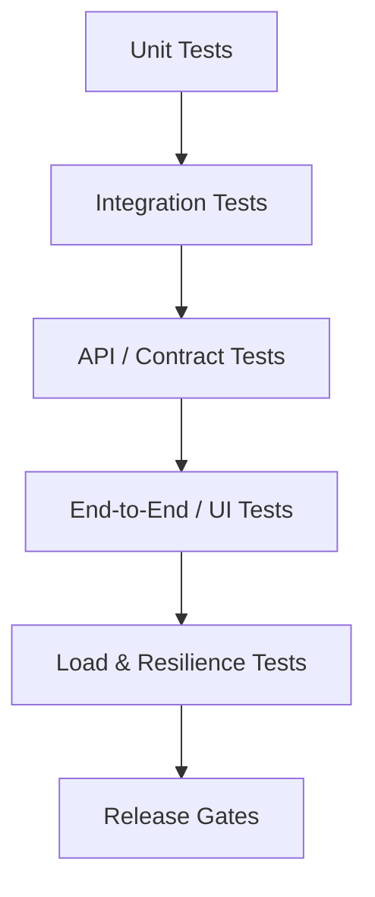

# AiClod Testing Strategy

## 1. Purpose

This document defines the **complete testing strategy** for AiClod across local development, CI, pre-production validation, and production-readiness gates.

It covers:

- unit tests,
- integration tests,
- API tests,
- end-to-end validation,
- load testing,
- local test execution before production deployment.

The objective is to ensure every major platform layer can be validated **locally first**, then in CI, then in staging, before production rollout.

---

## 2. Testing Principles

AiClod testing should follow these principles:

1. **Shift left**: developers should catch failures locally before pushing.
2. **Pyramid discipline**: favor many unit tests, fewer integration tests, and selective end-to-end tests.
3. **Production realism**: integration and load tests should use infrastructure close to production topology.
4. **Determinism**: tests should be reliable and repeatable.
5. **Fast feedback**: core validation must run quickly on laptops and CI.
6. **Environment parity**: Docker Compose should support most pre-production validation.
7. **Release safety**: production deploys should depend on explicit quality gates.

---

## 3. Test Layers Overview

### 3.1 Required Test Layers

| Layer | Goal | Runs Locally | Runs in CI | Runs Pre-Prod |
|---|---|---|---|---|
| Unit tests | validate isolated business logic | Yes | Yes | Optional |
| Integration tests | validate modules with real dependencies | Yes | Yes | Yes |
| API tests | validate HTTP contracts and auth flows | Yes | Yes | Yes |
| E2E/UI tests | validate key user journeys | Yes | Yes | Yes |
| Load tests | validate scale/performance thresholds | Limited | Optional | Yes |
| Config/deploy validation | validate Compose, Helm, env, observability setup | Yes | Yes | Yes |

---

## 4. Local-First Testing Workflow

Every developer should be able to validate the stack locally before opening a PR or promoting to production.

### 4.1 Local Validation Targets

At minimum, local validation should support:

- config and deployment scaffold validation,
- backend unit tests,
- backend integration tests against Docker Compose services,
- frontend unit/component tests,
- API test collection execution,
- smoke end-to-end flows,
- optional local load smoke tests.

### 4.2 Local Testing Commands

Recommended local command entrypoints:

- `make test-local`
- `make test-config`
- `make test-unit`
- `make test-integration`
- `make test-api`
- `make test-e2e`
- `make test-load-smoke`

In this repository state, `make test-local` validates the deployment/configuration scaffolding and local tool availability while application-specific test commands are reserved for the implementation phase.

---

## 5. Unit Testing Strategy

### 5.1 Backend Unit Tests

Backend unit tests should target:

- domain entities,
- value objects,
- policy checks,
- pricing and entitlement rules,
- ranking and scoring logic,
- DTO mappers,
- helper utilities,
- plugin contract adapters.

Recommended tooling:
- Jest or Vitest for NestJS modules,
- test doubles for repositories and gateways,
- deterministic fixtures.

### 5.2 Frontend Unit Tests

Frontend unit tests should target:

- utility functions,
- rendering logic,
- view-model hooks,
- formatter helpers,
- filter-state reducers,
- SEO metadata builders,
- lightweight components.

Recommended tooling:
- Vitest / Jest,
- React Testing Library,
- Storybook interaction tests where useful.

### 5.3 Unit Test Expectations

- fast execution,
- no real network calls,
- no shared mutable state,
- deterministic seed data,
- coverage focused on critical logic, not vanity metrics.

---

## 6. Integration Testing Strategy

### 6.1 Backend Integration Tests

Integration tests should validate the NestJS modules against real dependencies where it matters.

Test targets:
- PostgreSQL persistence,
- RabbitMQ message publishing/consumption,
- OpenSearch indexing flow,
- Valkey caching behavior,
- MinIO object upload/download flows,
- Keycloak/OIDC token verification stubs or test realm,
- billing lifecycle flows with gateway mocks.

### 6.2 Integration Test Environment

Docker Compose should be the default integration-test environment.

Required services:
- postgres,
- valkey,
- rabbitmq,
- opensearch,
- minio,
- keycloak,
- otel-collector where telemetry validation matters.

### 6.3 Integration Test Scope

Examples:
- publish job → outbox event → worker index update,
- submit application → resume stored → event logged,
- create subscription → entitlements updated,
- unlock candidate profile → usage event created,
- security guard denies cross-tenant access.

### 6.4 Data Management

Use:
- isolated test databases or schemas,
- resettable fixtures,
- idempotent seed scripts,
- deterministic search index setup/teardown.

---

## 7. API Testing Strategy

### 7.1 API Test Categories

API tests should cover:

- authentication flows,
- authorization failures,
- CRUD success/error cases,
- tenant isolation,
- search filters and payloads,
- billing and entitlements behavior,
- admin-only routes,
- webhook verification flows.

### 7.2 Recommended Tooling

Recommended tools:
- Postman/Newman or Bruno for executable API collections,
- Pact or schema contract verification where useful,
- OpenAPI-driven validation for request/response contracts.

### 7.3 API Environments

Maintain API collections for:
- local,
- staging,
- production smoke-only.

### 7.4 Critical API Scenarios

Examples:
- candidate logs in and fetches profile,
- recruiter creates job and publishes it,
- candidate applies to a job,
- employer searches candidates and unlocks one profile,
- admin suspends tenant,
- payment webhook transitions invoice/subscription state.

---

## 8. End-to-End Testing Strategy

### 8.1 E2E Scope

End-to-end tests should be selective and focused on critical journeys:

- homepage → search → job details → apply,
- candidate login → dashboard → applications,
- employer login → create job → publish → applicants view,
- billing upgrade flow,
- admin moderation flow.

### 8.2 Recommended Tooling

- Playwright for browser automation,
- test accounts and seeded data,
- environment-isolated execution against local Compose and staging.

### 8.3 E2E Execution Policy

- smoke E2E locally before major UI/backend changes,
- full E2E in CI for protected branches/nightly,
- staging E2E as a release gate before production.

---

## 9. Load Testing Strategy

### 9.1 Load Test Goals

Load testing should validate:

- anonymous job search traffic,
- authenticated dashboard API traffic,
- candidate apply bursts,
- search suggestion throughput,
- worker throughput under indexing or notification load,
- billing/report generation spikes.

### 9.2 Recommended Tooling

- k6 for HTTP/API load testing,
- optional browser-based load for critical UI journeys later,
- Grafana/Prometheus dashboards for correlated analysis.

### 9.3 Load Test Profiles

Recommended profiles:

- **smoke**: short local validation,
- **baseline**: normal expected production traffic,
- **stress**: capacity limit discovery,
- **spike**: sudden burst behavior,
- **soak**: long-duration stability.

### 9.4 Local Load Testing

Local load testing should be limited to smoke scenarios such as:
- search endpoint latency sanity checks,
- API route throughput spot checks,
- worker queue consumption sanity checks.

Large-scale stress and soak tests should run in staging or a dedicated performance environment.

---

## 10. Configuration and Deployment Testing

### 10.1 What Must Be Tested Before Deployment

Before any production deployment, validate:

- `docker-compose.yml`,
- environment templates,
- Helm chart structure and values,
- HPA templates,
- ingress/service wiring,
- OpenTelemetry collector configuration,
- GitHub Actions workflow syntax/logic,
- local deployment instructions.

### 10.2 Local Deployment Validation

The repository includes local validation scaffolding so developers can check:

- required deployment files exist,
- config markers are present,
- Docker Compose is syntactically valid if Docker is installed,
- Helm chart values/templates are present and lintable if Helm is installed.

### 10.3 Recommended Promotion Gates

Promotion path:

1. local validation passes,
2. CI validation passes,
3. unit/integration/API/E2E gates pass,
4. staging deployment and smoke/load gates pass,
5. production rollout can proceed.

---

## 11. CI/CD Quality Gates

### 11.1 Pull Request Gates

Every PR should run:

- config/deployment validation,
- unit tests,
- targeted integration tests,
- API contract checks,
- linting and static analysis.

### 11.2 Main Branch Gates

On merges to `main`, run:

- full validation suite,
- image build,
- artifact publication,
- Helm/package validation,
- staging deployment,
- staging smoke tests.

### 11.3 Pre-Production Gates

Before production deployment, run:

- staging smoke tests,
- release-candidate API tests,
- focused E2E tests,
- load smoke or baseline profile,
- deployment health verification,
- rollback readiness validation.

---

## 12. Test Data and Environment Management

### 12.1 Seed Data Requirements

Local and staging environments should have seeded fixtures for:

- candidate accounts,
- employer accounts,
- admin accounts,
- sample jobs,
- sample applications,
- featured jobs,
- subscription states,
- candidate profiles and resumes,
- search indexes.

### 12.2 Isolation Rules

- no tests should depend on production data,
- CI test environments should be disposable,
- load tests should avoid polluting shared environments unless explicitly planned,
- PII in test data must be synthetic.

---

## 13. Non-Functional Verification

Also validate:

- observability emission (logs/metrics/traces),
- security and auth failures,
- retry/idempotency behavior,
- backup/restore drills,
- queue backlog handling,
- autoscaling behavior in staging,
- graceful shutdown/restart behavior.

---

## 14. Local Execution Matrix

| Test Type | Local Today | Local After App Implementation | Notes |
|---|---|---|---|
| Config/deploy validation | Yes | Yes | via `make test-local` / `scripts/test-local.sh` |
| Backend unit tests | Planned | Yes | NestJS/Jest once code exists |
| Frontend unit tests | Planned | Yes | Next.js/Vitest once code exists |
| Integration tests | Planned | Yes | Docker Compose-backed |
| API tests | Planned | Yes | Newman/Bruno local collections |
| E2E tests | Planned | Yes | Playwright local/staging |
| Load smoke tests | Planned | Yes | k6 smoke locally |

---

## 15. Recommended Implementation Sequence

1. Keep local config/deployment validation green.
2. Add backend unit tests first with domain logic.
3. Add backend integration tests against Docker Compose services.
4. Add API collections and contract checks.
5. Add frontend unit/component tests.
6. Add Playwright smoke journeys.
7. Add k6 smoke and staging baseline load tests.
8. Enforce the full promotion gate before production deployment.

This ensures AiClod remains testable locally at every stage while evolving toward production-grade validation depth.
