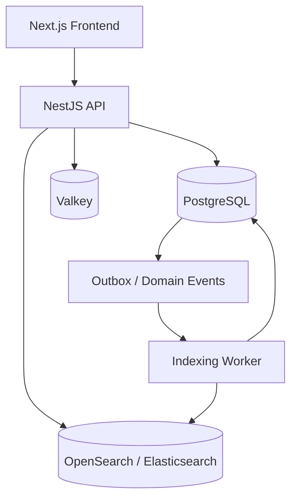

# AiClod OpenSearch / Elasticsearch Search Architecture

## 1. Purpose

This document defines the **advanced search architecture** for AiClod using **OpenSearch or Elasticsearch-compatible APIs**.

It covers:

- job search,
- candidate search,
- faceted filtering,
- auto-suggestions,
- relevance ranking,
- geo-search,
- indexing strategy,
- query optimization.

The design is intended for a SaaS job portal with:
- high read volume,
- tenant-aware search isolation,
- employer and candidate search experiences,
- scalable indexing and low-latency discovery.

---

## 2. Search Goals

AiClod search must support:

1. **Fast public job discovery** with faceted filtering.
2. **Employer-side candidate discovery** with rich skill and experience matching.
3. **Auto-suggestions** for keywords, companies, titles, skills, and locations.
4. **Relevance ranking** that blends text match, freshness, quality, and business signals.
5. **Geo-search** for radius and region-based results.
6. **Tenant-aware isolation** for private data and B2B employer workspaces.
7. **Operational scalability** through asynchronous indexing and optimized query patterns.

---

## 3. Search Domains

AiClod should separate search into at least two logical search domains:

- **Job Search**
- **Candidate Search**

Optional later domains:
- company search,
- community content search,
- resources/article search,
- admin moderation search.

### 3.1 Core Index Set

Recommended initial indexes:

- `jobs-v1`
- `candidates-v1`
- `companies-v1` (optional but useful)
- `suggestions-v1` (optional dedicated suggestion index)

Use aliases for zero-downtime reindexing:

- `jobs-read` → current jobs index
- `jobs-write` → current jobs index
- `candidates-read` → current candidates index
- `candidates-write` → current candidates index

---

## 4. High-Level Search Architecture



### 4.1 Responsibilities

- **PostgreSQL** remains the system of record.
- **OpenSearch/Elasticsearch** stores denormalized search documents.
- **Workers** build and synchronize search indexes asynchronously.
- **API layer** translates product filters into optimized search queries.
- **Cache layer** stores hot suggestion and search metadata results.

---

## 5. Job Search Document Design

### 5.1 `jobs` Search Document Shape

Example search document:

```json
{
  "id": "job_123",
  "tenant_id": "tenant_1",
  "organization_id": "org_9",
  "job_slug": "senior-backend-engineer-berlin-123",
  "title": "Senior Backend Engineer",
  "title_normalized": "senior backend engineer",
  "company_name": "AiClod Labs",
  "company_slug": "aiclod-labs",
  "description": "...",
  "summary": "Build scalable APIs and event-driven systems.",
  "skills": ["node.js", "nestjs", "postgresql", "rabbitmq"],
  "employment_type": "full_time",
  "workplace_type": "hybrid",
  "experience_min_years": 5,
  "experience_max_years": 8,
  "salary_min": 120000,
  "salary_max": 150000,
  "salary_currency": "USD",
  "country_code": "US",
  "state_code": "CA",
  "city": "San Francisco",
  "location_text": "San Francisco, California, United States",
  "geo_point": { "lat": 37.7749, "lon": -122.4194 },
  "is_remote": false,
  "is_featured": true,
  "status": "published",
  "published_at": "2026-03-20T10:00:00Z",
  "expires_at": "2026-04-20T10:00:00Z",
  "application_count": 42,
  "quality_score": 0.91,
  "popularity_score": 0.64,
  "boost_score": 1.20,
  "suggest": {
    "input": ["Senior Backend Engineer", "Backend Engineer", "NestJS Engineer"]
  }
}
```

### 5.2 Job Search Mapping Principles

Use field types intentionally:

- `text` with analyzers for full-text fields like `title`, `summary`, `description`.
- `keyword` for exact-match filters like `employment_type`, `tenant_id`, `company_slug`.
- `date` for freshness and lifecycle logic.
- `float` / `scaled_float` for quality and ranking signals.
- `geo_point` for distance/radius search.
- `completion` or dedicated suggest analyzers for auto-suggest fields.

### 5.3 Job Multi-Field Mapping

Recommended approach:

- `title` as `text`
- `title.keyword` as `keyword`
- `title.ngram` for partial matching where needed
- `company_name` as `text`
- `company_name.keyword` as `keyword`
- `skills` as `keyword`
- `location_text` as both `text` and `keyword`

This supports both search relevance and exact filtering/aggregations.

---

## 6. Candidate Search Document Design

### 6.1 `candidates` Search Document Shape

Example search document:

```json
{
  "id": "cand_456",
  "tenant_id": "tenant_1",
  "candidate_profile_id": "cp_456",
  "user_id": "user_456",
  "full_name": "Alex Morgan",
  "headline": "Senior Full Stack Engineer",
  "summary": "Built SaaS platforms using React, NestJS, and PostgreSQL.",
  "skills": ["react", "typescript", "nestjs", "postgresql", "aws"],
  "primary_role": "full_stack_engineer",
  "experience_years": 7,
  "seniority": "senior",
  "current_company": "TechCo",
  "current_location_text": "Austin, Texas, United States",
  "geo_point": { "lat": 30.2672, "lon": -97.7431 },
  "open_to_work": true,
  "preferred_workplace_types": ["remote", "hybrid"],
  "preferred_roles": ["senior_full_stack_engineer", "tech_lead"],
  "salary_expectation_min": 140000,
  "salary_expectation_max": 170000,
  "salary_currency": "USD",
  "resume_text": "...",
  "resume_quality_score": 0.87,
  "profile_completeness_score": 0.93,
  "last_active_at": "2026-03-19T18:25:00Z",
  "visibility": "tenant_visible",
  "boost_score": 1.05,
  "suggest": {
    "input": ["Alex Morgan", "Senior Full Stack Engineer", "NestJS Developer"]
  }
}
```

### 6.2 Candidate Search Mapping Principles

- `headline`, `summary`, and `resume_text` are full-text fields.
- `skills`, `preferred_roles`, and `seniority` are filterable `keyword` fields.
- `last_active_at` supports freshness ranking.
- `geo_point` supports radius and location scoring.
- `visibility` and `tenant_id` enforce access control at query time.

---

## 7. Analyzer Strategy

### 7.1 Recommended Analyzer Set

Use custom analyzers for job-portal semantics.

Recommended analyzers:

- **standard analyzer** for baseline tokenization.
- **english analyzer** for stemming on descriptions and long-form content.
- **edge-ngram analyzer** for auto-suggestions.
- **keyword lowercase normalizer** for exact matching on normalized labels.
- **synonym analyzer** for titles and skill equivalence.

### 7.2 Synonym Examples

Examples of synonym groups:

- `software engineer, software developer, sde`
- `frontend, front-end, ui engineer`
- `backend, back-end, api engineer`
- `devops, platform engineer, sre`
- `hr, human resources, talent acquisition`

### 7.3 Skill Normalization Strategy

Before indexing:
- normalize skill casing,
- merge known aliases,
- strip duplicate whitespace,
- map vendor variants where appropriate.

Example:
- `NodeJS`, `Node.js`, `node js` → `node.js`
- `Postgres`, `PostgreSQL` → `postgresql`
- `ReactJS`, `React.js` → `react`

---

## 8. Filtering and Faceting Design

### 8.1 Job Filters

Recommended job filters:

- keyword
- location
- geo radius
- remote/hybrid/onsite
- employment type
- company
- salary range
- experience range
- posted within last X days
- featured only
- visa/work authorization where applicable

### 8.2 Candidate Filters

Recommended candidate filters:

- skills
- years of experience
- seniority
- current or preferred location
- geo radius
- open-to-work status
- preferred workplace type
- salary expectation range
- last active date
- profile completeness threshold

### 8.3 Facet Implementation Notes

Use aggregations only on fields that matter for user decision-making.

For jobs, likely facets:
- employment type
- workplace type
- city/state
- company
- salary bucket
- experience bucket

For candidates, likely facets:
- skills
- seniority
- location
- workplace type
- years of experience bucket

### 8.4 Aggregation Optimization

- limit high-cardinality facets where they create latency or noisy UX.
- prefer curated bucket facets for salary and experience.
- use `post_filter` when needing facet counts independent of some UI filters.
- avoid over-aggregating on every request when the UI does not need all facet groups.

---

## 9. Auto-Suggestions

### 9.1 Suggestion Types

AiClod should support suggestions for:

- job titles,
- companies,
- locations,
- skills,
- candidate names (employer-only),
- candidate titles/headlines.

### 9.2 Suggestion Approaches

Recommended approach:

1. **Completion suggester** for high-speed prefix suggestions.
2. **Edge n-gram text fields** for partial match and typo-tolerant experiences.
3. Optional dedicated **`suggestions-v1` index** for centralized cross-entity suggestions.

### 9.3 Suggestion Ranking Signals

Rank suggestions by a blend of:

- popularity,
- recency,
- tenant relevance,
- exact prefix match,
- configured business boost.

### 9.4 Suggestion Query Pattern

Use lightweight suggestion queries with:
- strict field targeting,
- small result counts,
- low payload size,
- optional cache for hot prefixes.

---

## 10. Relevance Ranking Strategy

### 10.1 Ranking Layers

Rank search results using a layered approach:

1. **Text relevance** via BM25.
2. **Exact-match boosts** for title/company/skills.
3. **Freshness decay** for recently published jobs or recently active candidates.
4. **Business-quality boosts** such as featured jobs or complete profiles.
5. **Geo proximity scoring** where location intent exists.
6. **Tenant-aware boosts** for private or preferred entities.

### 10.2 Job Ranking Signals

Recommended job ranking inputs:

- keyword/title match,
- keyword/skill overlap,
- exact company/title match,
- freshness (`published_at`),
- job quality score,
- employer trust score,
- application conversion or CTR proxy,
- featured boost,
- geo distance relevance.

### 10.3 Candidate Ranking Signals

Recommended candidate ranking inputs:

- skill overlap with search request,
- headline/title match,
- resume text match,
- experience fit,
- profile completeness,
- recency (`last_active_at`),
- open-to-work status,
- geo proximity,
- employer-specific boost rules.

### 10.4 Function Score Model

Use `function_score` or equivalent ranking logic to blend textual relevance with structured boosts.

Typical functions:
- gauss decay on `published_at` for jobs,
- gauss decay on `last_active_at` for candidates,
- weight boost for `is_featured = true`,
- field value factors for `quality_score`, `profile_completeness_score`, `boost_score`.

---

## 11. Geo-Search Design

### 11.1 Geo Use Cases

Support:

- jobs within X miles/kilometers,
- jobs near a city center,
- candidates within hiring radius,
- remote-first fallback behavior,
- sorting by distance when relevant.

### 11.2 Geo Fields

Use `geo_point` in both jobs and candidates indexes.

Also index normalized geography fields:
- `country_code`
- `state_code`
- `city`
- `location_text`

### 11.3 Geo Query Patterns

Recommended patterns:

- `geo_distance` filter for strict radius limits,
- distance sort when location is primary intent,
- distance scoring inside `function_score` when location is one relevance dimension,
- explicit remote-job boost when user searches remotely.

### 11.4 Remote and Hybrid Logic

Geo logic should not exclude jobs incorrectly.

Example policy:
- if `remote=true`, remote jobs bypass strict radius filters,
- hybrid jobs may still use geography,
- onsite jobs prioritize radius match.

---

## 12. Query Design Patterns

### 12.1 Job Search Query Template

A production job query typically uses:

- `bool.must` for core keyword query,
- `bool.filter` for structured filters,
- `should` clauses for boosts,
- `function_score` for freshness and business weights,
- aggregations for visible facets,
- `_source` filtering for payload reduction.

Example shape:

```json
{
  "query": {
    "function_score": {
      "query": {
        "bool": {
          "must": [
            {
              "multi_match": {
                "query": "senior nestjs engineer",
                "fields": [
                  "title^5",
                  "title.ngram^3",
                  "skills^4",
                  "summary^2",
                  "description"
                ],
                "type": "best_fields"
              }
            }
          ],
          "filter": [
            { "term": { "status": "published" } },
            { "term": { "employment_type": "full_time" } },
            { "range": { "salary_max": { "gte": 120000 } } }
          ],
          "should": [
            { "term": { "is_featured": true } },
            { "term": { "skills": "nestjs" } }
          ]
        }
      },
      "functions": [
        {
          "gauss": {
            "published_at": {
              "origin": "now",
              "scale": "14d",
              "offset": "2d",
              "decay": 0.5
            }
          }
        },
        {
          "field_value_factor": {
            "field": "quality_score",
            "missing": 0.5
          }
        }
      ],
      "score_mode": "sum",
      "boost_mode": "multiply"
    }
  }
}
```

### 12.2 Candidate Search Query Template

Candidate queries should emphasize:

- skill overlap,
- headline match,
- recency,
- completeness,
- geo intent.

Prefer targeted queries over giant full-text scans of resume blobs when filters already narrow results.

### 12.3 Multi-Match Recommendations

Use:
- `best_fields` when exact role/title precision matters,
- `cross_fields` when terms can span multiple short fields,
- `phrase` or `phrase_prefix` boosts for exact title intent.

---

## 13. Indexing Strategy

### 13.1 Source of Truth and Sync Model

Never write directly from the product UI to OpenSearch as the system of record.

Recommended flow:
1. write business data to PostgreSQL,
2. emit domain event or outbox event,
3. worker transforms source data into search document,
4. bulk index to OpenSearch,
5. store indexing status and retry failures.

### 13.2 Bulk Indexing

Use bulk indexing for:
- reindexing,
- high-volume imports,
- large job publication runs,
- resume parsing enrichment updates.

Best practices:
- batch sizes tuned by payload size, not just document count,
- worker concurrency caps,
- retry with backoff on partial failures,
- dead-letter handling for permanently invalid documents.

### 13.3 Partial Updates vs Full Rebuilds

Use partial updates for:
- application count,
- last active timestamp,
- boost/quality score changes.

Use full document rebuilds for:
- mapping changes,
- synonym model changes,
- text composition logic changes,
- major schema evolution.

### 13.4 Zero-Downtime Reindexing

Recommended flow:
1. create `jobs-v2`,
2. backfill via worker,
3. validate counts and query quality,
4. shift `jobs-read` alias,
5. shift `jobs-write` alias,
6. retire old index after stabilization.

---

## 14. Query Optimization Guidance

### 14.1 General Optimization Principles

- use `filter` clauses for non-scoring constraints,
- avoid expensive wildcard queries on large text fields,
- keep `_source` payloads small,
- use stored fields or source filtering when possible,
- profile slow queries regularly,
- avoid deep pagination via large `from` offsets.

### 14.2 Pagination Strategy

Recommended pagination:

- shallow pagination via `from/size` for typical UI pages,
- `search_after` for deep result traversal,
- stable sort keys for consistent pagination.

### 14.3 Aggregation Optimization

- only request aggregations needed by the current UI state,
- pre-bucket numerical ranges instead of freeform cardinality-heavy faceting,
- cache stable facet-heavy queries where appropriate.

### 14.4 Caching Strategy

Cache candidates:
- suggestion responses,
- popular anonymous job searches,
- metadata/facet dictionaries,
- location autocomplete results.

Do not aggressively cache:
- highly personalized employer candidate search results,
- security-sensitive tenant-private search results unless scoped carefully.

### 14.5 Slow Query Guardrails

Add protection against:
- very large `size` values,
- unbounded aggregations,
- regex or leading wildcard abuse,
- overly broad anonymous candidate search exposure.

---

## 15. Security and Tenant Isolation

### 15.1 Tenant Filtering

Every private search query must include tenant-aware filters.

Examples:
- candidate search always filtered by employer tenant access rules,
- employer-private jobs filtered by `tenant_id`,
- visibility rules enforced in both API logic and search query construction.

### 15.2 Field Exposure Rules

The API should not return raw search documents directly.

Instead:
- execute search,
- map allowed fields into response DTOs,
- hide sensitive candidate data unless permitted,
- redact internal ranking or boost signals from public clients.

### 15.3 Abuse Protection

- rate limit public anonymous search,
- limit export-heavy employer queries,
- audit candidate profile search access,
- require stronger auth for private candidate discovery.

---

## 16. Operational Monitoring

Track:

- search latency (p50/p95/p99),
- zero-result query rate,
- click-through rate,
- apply conversion after search,
- candidate outreach conversion,
- indexing lag,
- indexing failure rate,
- suggestion latency.

### 16.1 Search Quality Monitoring

Continuously evaluate:
- top queries,
- zero-result queries,
- low-CTR queries,
- failed suggestion patterns,
- synonym coverage gaps,
- ranking drift after scoring changes.

---

## 17. Recommended Implementation Sequence

1. Define `jobs` and `candidates` search document contracts.
2. Create mappings, analyzers, and aliases.
3. Implement indexing workers from PostgreSQL/outbox events.
4. Launch job search with filters and faceting.
5. Add suggestions and geo-search.
6. Launch employer-side candidate search.
7. Add ranking signal tuning and analytics feedback loops.
8. Add zero-downtime reindex automation.

This sequence prioritizes public job discovery first, then candidate discovery, then advanced relevance maturity.
